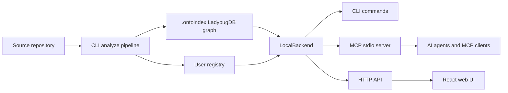

# OntoIndex

**Graph-powered code intelligence for AI agents.** OntoIndex builds a local code graph for a repository and exposes it through a CLI, an MCP server, an HTTP API, and a browser UI.

> Important: OntoIndex has no official cryptocurrency, token, or coin. Any token using the OntoIndex name is not affiliated with this project or its maintainers.

[](https://www.gnu.org/licenses/agpl-3.0.html)
[](https://github.com/ontograph/ontoindex)

- Current release: `1.9.3`
- Source repository: [github.com/ontograph/ontoindex](https://github.com/ontograph/ontoindex)
- Security policy: [SECURITY.md](SECURITY.md)
- Enterprise contact: [erasyuk@gmail.com](mailto:erasyuk@gmail.com)
- Languages: [Русский](README.ru.md) · [简体中文](README.zh-CN.md)

## Abstract

AI coding agents often work from small slices of a codebase. That is fast, but fragile: a model can edit a function without seeing callers, rename a symbol without downstream impact analysis, or miss coupling that sits outside the current prompt.

OntoIndex reduces that uncertainty by precomputing a repository graph. The graph records files, symbols, imports, calls, inheritance, routes, tools, documentation sections, communities, and execution flows. Agents can then ask graph-level questions before editing: where is this symbol used, what process does it participate in, what tests are nearby, and what changes are risky?

The index is local-first. Repository data is stored in `.ontoindex/`, while the global registry under `~/.ontoindex/` only tracks indexed repository metadata and paths.

## What It Provides

| Area | Capability |
| --- | --- |
| Code graph | Files, folders, functions, classes, methods, interfaces, properties, routes, tools, docs sections, and process nodes |
| Relationships | `CONTAINS`, `DEFINES`, `CALLS`, `IMPORTS`, `EXTENDS`, `IMPLEMENTS`, `MEMBER_OF`, `STEP_IN_PROCESS`, `HANDLES_ROUTE`, and related edges |
| Search | BM25, graph search, optional semantic retrieval, reciprocal-rank fusion, and process-grouped results |
| Agent safety | Impact analysis, diff-to-symbol mapping, pre-commit audit, review helpers, and target-repository validation |
| Interfaces | CLI, MCP stdio server, HTTP API, generated wiki, generated skills, and React/Vite web UI |
| Multi-repo work | Named repository registry, repo labels, group contracts, and cross-repo context surfaces |

## Installation

### Third-party Prerequisites

OntoIndex runs on Node.js and uses native parser packages for some languages. Install the following before installing OntoIndex.

| Requirement | Linux | Windows |
| --- | --- | --- |
| Node.js | Node.js `20` or newer plus `npm` | Node.js `20` or newer plus `npm` |
| Git | `git` CLI for repository metadata and diff analysis | Git for Windows |
| Native build tools | `python3`, `make`, and `g++` for optional native parser builds | Python 3 and Microsoft C++ Build Tools from Visual Studio Build Tools |
| Shell | `bash` for the install script examples | PowerShell 5.1 or PowerShell 7 |
| Optional containers | Docker Engine and Docker Compose | Docker Desktop |

Linux example:

```bash
node --version
npm --version
git --version
python3 --version
make --version
g++ --version
```

Windows PowerShell example:

```powershell
node --version
npm --version
git --version
python --version
npm config get msvs_version
```

### Install the Latest GitHub Release

Linux and macOS:

```bash
curl -fsSL https://raw.githubusercontent.com/ontograph/ontoindex/master/scripts/install-ontoindex-latest.sh | bash
ontoindex --version
```

Windows PowerShell:

```powershell
iwr -useb https://raw.githubusercontent.com/ontograph/ontoindex/master/scripts/install-ontoindex-latest.ps1 | iex
ontoindex --version
```

From a local checkout:

| Platform | Command |
| --- | --- |
| Linux/macOS | `./scripts/install-ontoindex-latest.sh` |
| Windows PowerShell | `powershell -ExecutionPolicy Bypass -File .\scripts\install-ontoindex-latest.ps1` |

The installers fetch the latest GitHub release, locate the `ontoindex-*.tgz` asset, and install it with `npm install -g`. If a global install is not writable, they fall back to a user npm prefix.

Installer configuration:

| Purpose | Linux/macOS | Windows PowerShell |
| --- | --- | --- |
| Use another release repository | `ONTOINDEX_GITHUB_REPO=owner/repo ./scripts/install-ontoindex-latest.sh` | `$env:ONTOINDEX_GITHUB_REPO='owner/repo'; .\scripts\install-ontoindex-latest.ps1` |
| Use a user npm prefix | `ONTOINDEX_NPM_PREFIX="$HOME/.local" ./scripts/install-ontoindex-latest.sh` | `$env:ONTOINDEX_NPM_PREFIX="$env:APPDATA\npm"; .\scripts\install-ontoindex-latest.ps1` |
| Force user prefix | `ONTOINDEX_NPM_PREFIX="$HOME/.local" ./scripts/install-ontoindex-latest.sh` | `.\scripts\install-ontoindex-latest.ps1 -ForceUserPrefix` |

### Install with npm

Use this path when npm publication is available in your environment.

| Platform | Command |
| --- | --- |
| Linux/macOS | `npm install -g ontoindex@1.9.3 && ontoindex --version` |
| Windows PowerShell | `npm install -g ontoindex@1.9.3; ontoindex --version` |

### Install from a Release Tarball URL

Use this when you want an immutable GitHub release asset.

| Platform | Command |
| --- | --- |
| Linux/macOS | `npm install -g https://github.com/ontograph/ontoindex/releases/download/v1.9.3/ontoindex-1.9.3.tgz && ontoindex --version` |
| Windows PowerShell | `npm install -g https://github.com/ontograph/ontoindex/releases/download/v1.9.3/ontoindex-1.9.3.tgz; ontoindex --version` |

## First Run

Run OntoIndex from the repository you want to index.

| Task | Linux/macOS | Windows PowerShell |
| --- | --- | --- |
| Index current repository | `ontoindex analyze` | `ontoindex analyze` |
| Check index status | `ontoindex status` | `ontoindex status` |
| Configure supported MCP clients | `ontoindex setup` | `ontoindex setup` |
| Start MCP server manually | `ontoindex mcp` | `ontoindex mcp` |
| Start local HTTP backend | `ontoindex serve` | `ontoindex serve` |
| Generate a wiki | `ontoindex wiki . --out docs/wiki` | `ontoindex wiki . --out docs/wiki` |

When the OntoIndex executable is launched from a helper checkout or global tool path, set the target repository explicitly so the MCP server cannot silently serve the wrong repository.

Linux/macOS:

```bash
cd /path/to/target/repo
export ONTOINDEX_MCP_PROJECT_CWD="$PWD"
export ONTOINDEX_MCP_REPO="$PWD"
ontoindex setup
ontoindex mcp --repo my-project
```

Windows PowerShell:

```powershell
Set-Location C:\path\to\target\repo
$env:ONTOINDEX_MCP_PROJECT_CWD = (Get-Location).Path
$env:ONTOINDEX_MCP_REPO = (Get-Location).Path
ontoindex setup
ontoindex mcp --repo my-project
```

At startup, OntoIndex prints both the executable working directory and the target project path. If `ONTOINDEX_MCP_REPO` or `--repo` points outside `ONTOINDEX_MCP_PROJECT_CWD`, startup fails unless `ONTOINDEX_MCP_ALLOW_REPO_MISMATCH=1` is set.

## MCP Setup

`ontoindex setup` configures supported MCP clients automatically. Manual examples are useful for debugging or for clients that do not support automatic setup.

| Client | Linux/macOS | Windows PowerShell |
| --- | --- | --- |
| Claude Code | `claude mcp add ontoindex -- ontoindex mcp` | `claude mcp add ontoindex -- ontoindex mcp` |
| Codex | `codex mcp add ontoindex -- ontoindex mcp` | `codex mcp add ontoindex -- ontoindex mcp` |
| Any MCP client | command: `ontoindex`, args: `["mcp"]` | command: `ontoindex`, args: `["mcp"]` |

Cursor example:

```json
{
  "mcpServers": {
    "ontoindex": {
      "command": "ontoindex",
      "args": ["mcp"]
    }
  }
}
```

OpenCode example:

```json
{
  "mcp": {
    "ontoindex": {
      "type": "local",
      "command": ["ontoindex", "mcp"]
    }
  }
}
```

## Common Agent Workflows

| Goal | Linux/macOS | Windows PowerShell |
| --- | --- | --- |
| Search for a flow | `ontoindex query "authentication flow"` | `ontoindex query "authentication flow"` |
| Inspect symbol context | `ontoindex ctx validateUser` | `ontoindex ctx validateUser` |
| Check blast radius | `ontoindex impact validateUser --include-tests --depth 2` | `ontoindex impact validateUser --include-tests --depth 2` |
| Review current diff | `ontoindex review diff` | `ontoindex review diff` |
| Audit before commit | `ontoindex detect-changes` | `ontoindex detect-changes` |
| Rebuild from scratch | `ontoindex analyze --force` | `ontoindex analyze --force` |

Core MCP surfaces include:

| Tool family | Use |
| --- | --- |
| Search and context | Find relevant symbols, files, routes, and processes |
| Impact analysis | Estimate upstream and downstream blast radius before edits |
| Diff review | Map changed hunks to graph symbols and execution flows |
| Docs evidence | Check requirements traceability, docs drift, and readiness |
| Refactor support | Use graph-aware rename and safety checks instead of plain find-and-replace |
| Systems audit | Inspect resource flow, path boundaries, error topology, concurrency, and taint-style signals |

## Functional Architecture

OntoIndex has three entry points over the same local graph backend.



| Component | Path | Responsibility |
| --- | --- | --- |
| CLI layer | [`ontoindex/src/cli/`](ontoindex/src/cli/) | User-facing commands such as `analyze`, `mcp`, `serve`, `query`, `impact`, `review`, `docs`, and `audit` |
| Ingestion pipeline | [`ontoindex/src/core/ingestion/`](ontoindex/src/core/ingestion/) | File scanning, Tree-sitter parsing, import/call/type resolution, route/tool/ORM extraction |
| Pipeline phases | [`ontoindex/src/core/ingestion/pipeline-phases/`](ontoindex/src/core/ingestion/pipeline-phases/) | Ordered graph build phases from scan to process extraction |
| Graph storage | [`ontoindex/src/core/lbug/`](ontoindex/src/core/lbug/) | LadybugDB schema, graph loading, query execution, and embedding persistence |
| Registry | [`ontoindex/src/storage/`](ontoindex/src/storage/) | `.ontoindex/` metadata, global registry, stale-index checks |
| Search | [`ontoindex/src/core/search/`](ontoindex/src/core/search/) | BM25, semantic retrieval, intent routing, ranking, and repository-map context |
| MCP backend | [`ontoindex/src/mcp/`](ontoindex/src/mcp/) | MCP resources, facade tools, `gn_*` workflows, and local backend dispatch |
| HTTP backend | [`ontoindex/src/server/`](ontoindex/src/server/) | Express API used by the browser UI and local bridge mode |
| Web UI | [`ontoindex-web/src/`](ontoindex-web/src/) | Graph explorer, repository browser, backend connection, and AI chat UI |
| Shared contracts | [`ontoindex-shared/src/`](ontoindex-shared/src/) | Shared API types, language identifiers, and constants |

### Indexing Pipeline

The graph build is a typed phase DAG:

```text
scan -> structure -> [markdown, cobol] -> parse -> [routes, tools, orm]
  -> crossFile -> mro -> communities -> processes
```

Key steps:

1. Scan files with repository ignore rules.
2. Parse supported languages with Tree-sitter providers.
3. Resolve imports, calls, receivers, constructors, type hints, inheritance, and method-resolution-order edges.
4. Enrich the graph with routes, MCP/RPC tools, ORM queries, markdown sections, communities, and execution flows.
5. Persist nodes and relations into LadybugDB under `.ontoindex/`.
6. Expose the same graph through CLI, MCP, HTTP, web UI, generated wiki pages, and generated skills.

Supported language depth varies, but the shared model covers TypeScript, JavaScript, Python, Java, Kotlin, C#, Go, Rust, PHP, Ruby, Swift, C, C++, Dart, and protobuf-related parser support.

## Web UI

The hosted UI can connect to a local backend at `http://localhost:4747`.

| Task | Linux/macOS | Windows PowerShell |
| --- | --- | --- |
| Start local backend | `ontoindex serve` | `ontoindex serve` |
| Open hosted UI | `xdg-open https://ontoindex.vercel.app` | `Start-Process https://ontoindex.vercel.app` |

To run the web UI from source:

| Platform | Command |
| --- | --- |
| Linux/macOS | `cd ontoindex-shared && npm install && npm run build && cd ../ontoindex-web && npm install && npm run dev` |
| Windows PowerShell | `Set-Location ontoindex-shared; npm install; npm run build; Set-Location ..\ontoindex-web; npm install; npm run dev` |

The browser-only mode can inspect uploaded ZIPs in memory. For larger repositories, start `ontoindex serve` and let the UI use the local index.

## Docker

| Task | Linux/macOS | Windows PowerShell |
| --- | --- | --- |
| Start stack | `docker compose up -d` | `docker compose up -d` |
| Backend URL | `http://localhost:4747` | `http://localhost:4747` |
| Web UI URL | `http://localhost:4173` | `http://localhost:4173` |

Images:

| Image | Purpose |
| --- | --- |
| `ghcr.io/ontograph/ontoindex:1.9.3` | CLI, MCP server, and `ontoindex serve` backend |
| `ghcr.io/ontograph/ontoindex-web:1.9.3` | Web UI |

## Comparison With Related Tools

This table compares functional scope, not benchmark speed.

| Capability | OntoIndex | GitNexus | Graphify | CodeGPT Deep Graph MCP | code-graph-mcp / Optave / CodeGraphContext | Serena | Graphiti MCP |
| --- | --- | --- | --- | --- | --- | --- | --- |
| Primary role | Local agent code-intelligence and safety layer | Historical donor and predecessor | Broad project knowledge graph and reports | MCP access to hosted CodeGPT/DeepGraph data | Lightweight local code graph servers | Symbolic code agent with memory | Temporal entity/relation memory |
| Local source indexing | Yes | Yes | Yes | No, hosted graph | Yes | Uses language tooling rather than the same persistent graph model | No, stores facts/events |
| Persistent repository graph | `.ontoindex/` LadybugDB plus registry | Legacy local graph | Exported graph/report artifacts | Hosted graph | Local AST/dependency stores | Project memories and language-server state | Neo4j-backed temporal graph |
| MCP runtime | 60+ facade and `gn_*` tools | Earlier concepts | Adjacent, artifact-focused | Hosted graph query tools | Search/call/impact tools | Agent tools for symbols and edits | Entity/relation memory tools |
| Impact analysis | Symbol, route, diff, process, test-aware signals | Partial predecessor capability | Report-oriented | Relationship queries only | Partial to strong, depending on project | Reference-based symbolic checks | Not source-code focused |
| Refactor safety | Graph-aware rename and verification guidance | Partial predecessor capability | No | No | Mostly analysis-oriented | Strong symbolic edits | No |
| Docs evidence | Requirements trace, drift checks, readiness reports | No current public successor surface | Strong mixed-document ingestion | No | Limited | Notes and memories | Memory facts, not repo docs drift |
| Best fit | Local editing and release workflows where agents need graph evidence before acting | Migration context | Human-readable project knowledge artifacts | Teams already using CodeGPT-hosted graphs | Smaller local AST/call graph MCP needs | Precise symbolic editing | Long-lived non-code memory |

Practical guidance:

- Choose OntoIndex when an agent must edit or release from local evidence: impact, diff review, docs drift, audit workflows, and target-repository safeguards.
- Choose Graphify when the main deliverable is a broad human-readable project knowledge graph across mixed artifacts.
- Choose CodeGPT Deep Graph MCP when your graph already lives in CodeGPT/DeepGraph.
- Choose smaller code-graph MCP servers when you only need AST/call/dependency lookup without a broader audit lifecycle.
- Choose Serena for language-server style symbolic edits.
- Choose Graphiti MCP for temporal memory over facts and events; it complements OntoIndex rather than replacing a source-code index.

## Repository Layout

| Path | Purpose |
| --- | --- |
| [`ontoindex/`](ontoindex/) | CLI, indexing pipeline, MCP server, graph logic |
| [`ontoindex-web/`](ontoindex-web/) | React/Vite web UI |
| [`ontoindex-shared/`](ontoindex-shared/) | Shared TypeScript types and constants |
| [`ontoindex-native/`](ontoindex-native/) | Optional native helpers |
| [`ontoindex-claude-plugin/`](ontoindex-claude-plugin/) | Claude integration assets |
| [`ontoindex-cursor-integration/`](ontoindex-cursor-integration/) | Cursor integration assets |
| [`docs/`](docs/) | ADRs, guides, generated wiki, and references |
| [`eval/`](eval/) | Evaluation harness |

## Development

Third-party development prerequisites are the same as installation, plus the package manager and compiler tools needed by native Node modules.

| Task | Linux/macOS | Windows PowerShell |
| --- | --- | --- |
| Install root dependencies | `npm install` | `npm install` |
| Build CLI/core | `cd ontoindex && npm install && npm run build` | `Set-Location ontoindex; npm install; npm run build` |
| Run unit tests | `cd ontoindex && npm run test:unit` | `Set-Location ontoindex; npm run test:unit` |
| Type-check web UI | `cd ontoindex-web && npx tsc -b --noEmit` | `Set-Location ontoindex-web; npx tsc -b --noEmit` |
| Build web UI | `cd ontoindex-web && npm run build` | `Set-Location ontoindex-web; npm run build` |
| Run web tests | `cd ontoindex-web && npm test` | `Set-Location ontoindex-web; npm test` |

Useful references:

- [ARCHITECTURE.md](ARCHITECTURE.md)
- [RUNBOOK.md](RUNBOOK.md)
- [GUARDRAILS.md](GUARDRAILS.md)
- [CONTRIBUTING.md](CONTRIBUTING.md)
- [TESTING.md](TESTING.md)
- [docs/README.md](docs/README.md)
- [docs/adr/0000-index.md](docs/adr/0000-index.md)
- [docs/ref/mcp.md](docs/ref/mcp.md)

## Security and Privacy

- CLI and MCP indexing are local by default.
- Repository indexes are stored in `.ontoindex/`.
- The global registry stores repository paths and metadata under the user profile.
- Browser-only mode keeps uploaded code in the browser session.
- Enterprise deployments can be self-hosted.

Report security issues through [SECURITY.md](SECURITY.md).

## Source and Donor Acknowledgments

OntoIndex includes code originally developed as **GitNexus**. Copyright and attribution for GitNexus contributors are preserved in [NOTICE](NOTICE).

The project also builds on open-source components and donated ecosystem work from upstream maintainers, including:

- [Model Context Protocol](https://modelcontextprotocol.io/)
- [Tree-sitter](https://tree-sitter.github.io/tree-sitter/)
- [LadybugDB](https://ladybugdb.com/)
- [Graphology](https://graphology.github.io/)
- [Sigma.js](https://www.sigmajs.org/)
- [Transformers.js](https://huggingface.co/docs/transformers.js)

See [NOTICE](NOTICE) for preserved attribution and third-party component notices.

## License

OntoIndex is licensed under AGPL-3.0-or-later. See [LICENSE](LICENSE).
