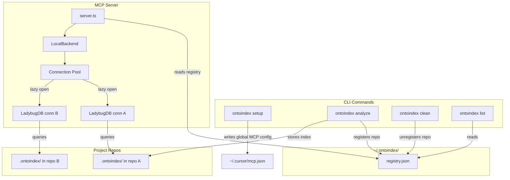
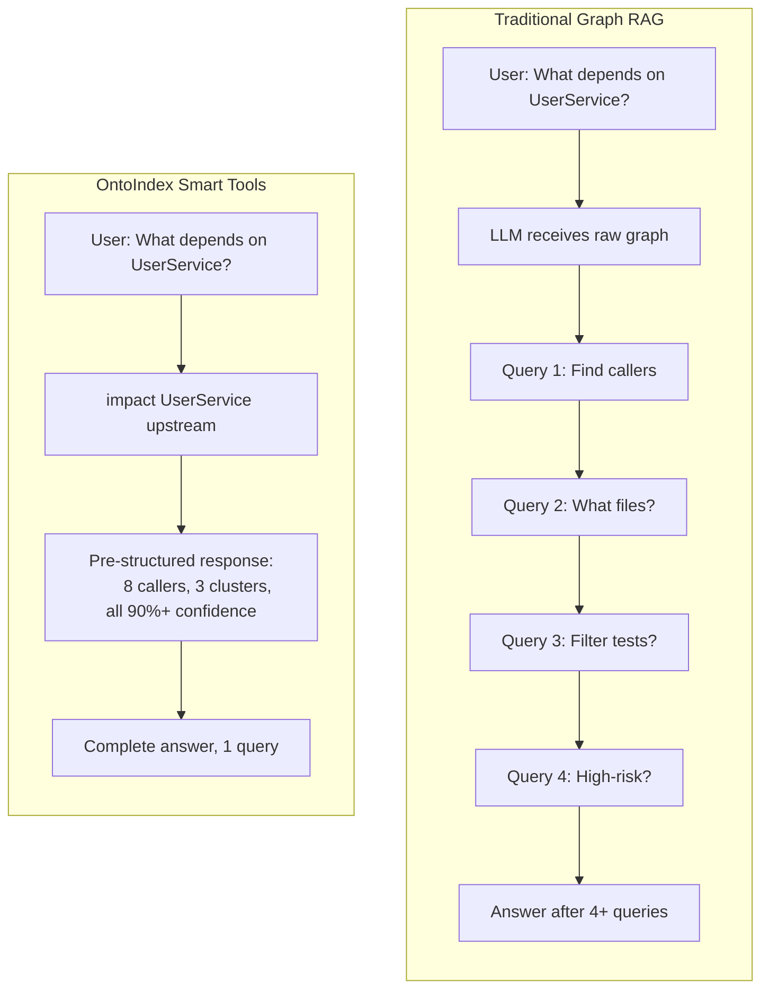

# OntoIndex
⚠️ Important Notice:** OntoIndex has NO official cryptocurrency, token, or coin. Any token/coin using the OntoIndex name on Pump.fun or any other platform is **not affiliated with, endorsed by, or created by** this project or its maintainers. Do not purchase any cryptocurrency claiming association with OntoIndex.

<div align="center">

  <a href="https://trendshift.io/repositories/19809" target="_blank">
    
  </a>

  <h2>Join the official Discord to discuss ideas, issues etc!</h2>

  <a href="https://discord.gg/MgJrmsqr62">
    
  </a>
  <a href="https://www.npmjs.com/package/ontoindex">
    
  </a>
  <a href="https://www.apache.org/licenses/LICENSE-2.0">
    
  </a>

  <p><strong>Enterprise (SaaS & Self-hosted)</strong> - <a href="https://akonlabs.com">akonlabs.com</a></p>

</div>

**Building nervous system for agent context.**

Indexes any codebase into a knowledge graph — every dependency, call chain, cluster, and execution flow — then exposes it through smart tools so AI agents never miss code.


https://github.com/user-attachments/assets/172685ba-8e54-4ea7-9ad1-e31a3398da72


> *Like DeepWiki, but deeper.* DeepWiki helps you *understand* code. OntoIndex lets you *analyze* it — because a knowledge graph tracks every relationship, not just descriptions.

**TL;DR:** The **Web UI** is a quick way to chat with any repo. The **CLI + MCP** is how you make your AI agent actually reliable — it gives Cursor, Claude Code, Codex, and friends a deep architectural view of your codebase so they stop missing dependencies, breaking call chains, and shipping blind edits. Even smaller models get full architectural clarity, making it compete with goliath models.

---

## Star History

[](https://www.star-history.com/#ontograph/ontoindex&type=date&legend=top-left)


## Two Ways to Use OntoIndex

|                   | **CLI + MCP**                                            | **Web UI**                                             |
| ----------------- | -------------------------------------------------------------- | ------------------------------------------------------------ |
| **What**    | Index repos locally, connect AI agents via MCP                 | Visual graph explorer + AI chat in browser                   |
| **For**     | Daily development with Cursor, Claude Code, Codex, Windsurf, OpenCode | Quick exploration, demos, one-off analysis                   |
| **Scale**   | Full repos, any size                                           | Limited by browser memory (~5k files), or unlimited via backend mode |
| **Install** | `npm install -g ontoindex`                                    | No install — [ontoindex.vercel.app](https://ontoindex.vercel.app) |
| **Storage** | LadybugDB native (fast, persistent)                               | LadybugDB WASM (in-memory, per session)                         |
| **Parsing** | Tree-sitter native bindings                                    | Tree-sitter WASM                                             |
| **Privacy** | Everything local, no network                                   | Everything in-browser, no server                             |

> **Bridge mode:** `ontoindex serve` connects the two — the web UI auto-detects the local server and can browse all your CLI-indexed repos without re-uploading or re-indexing.

---

## Enterprise

OntoIndex is available as an **enterprise offering** - either as a fully managed **SaaS** or a **self-hosted** deployment. Also available for **commercial use** of the OSS version with proper licensing.

Enterprise includes:
- **PR Review** - automated blast radius analysis on pull requests
- **Auto-updating Code Wiki** - always up-to-date documentation (Code Wiki is also available in OSS)
- **Auto-reindexing** - knowledge graph stays fresh automatically
- **Multi-repo support** - unified graph across repositories
- **OCaml support** - additional language coverage
- **Priority feature/language support** - request new languages or features

**Upcoming:**
- Auto regression forensics
- End-to-end test generation

👉 Learn more at [akonlabs.com](https://akonlabs.com)

💬 For commercial licensing or enterprise inquiries, ping us on [Discord](https://discord.gg/AAsRVT6fGb) or drop an email at founders@akonlabs.com

---

## Development

- [ARCHITECTURE.md](ARCHITECTURE.md) — packages, index → graph → MCP flow, where to change code
- [RUNBOOK.md](RUNBOOK.md) — analyze, embeddings, stale index, MCP recovery, CI snippets
- [GUARDRAILS.md](GUARDRAILS.md) — safety rules and operational “Signs” for contributors and agents
- [CONTRIBUTING.md](CONTRIBUTING.md) — license, setup, commits, and pull requests
- [TESTING.md](TESTING.md) — test commands for `ontoindex` and `ontoindex-web`

## CLI + MCP (recommended)

The CLI indexes your repository and runs an MCP server that gives AI agents deep codebase awareness.

### 5-Minute Quickstart

```bash
# 1. Index your repository from its root
npx ontoindex@latest analyze

# 2. Start the local HTTP bridge for the browser UI
npx ontoindex@latest serve
```

Then open [ontoindex.vercel.app](https://ontoindex.vercel.app). The web UI detects the local server at `http://localhost:4747` and connects to the repos you indexed with `analyze`.

To configure MCP for your editor, run `npx ontoindex@latest setup` once — or set it up manually below.

### MCP Setup

`ontoindex setup` auto-detects your editors and writes the correct global MCP config. You only need to run it once.

### Editor Support

| Editor                | MCP | Skills | Hooks (auto-augment) | Support        |
| --------------------- | --- | ------ | -------------------- | -------------- |
| **Claude Code** | Yes | Yes    | Yes (PreToolUse + PostToolUse) | **Full** |
| **Cursor**      | Yes | Yes    | —                   | MCP + Skills   |
| **Codex**       | Yes | Yes    | —                   | MCP + Skills   |
| **Windsurf**    | Yes | —     | —                   | MCP            |
| **OpenCode**    | Yes | Yes    | —                   | MCP + Skills   |

> **Claude Code** gets the deepest integration: MCP tools + agent skills + PreToolUse hooks that enrich searches with graph context + PostToolUse hooks that auto-reindex after commits.

## Community Integrations

Built by the community — not officially maintained, but worth checking out.

| Project | Author | Description |
|---------|--------|-------------|
| [pi-ontoindex](https://github.com/tintinweb/pi-ontoindex) | [@tintinweb](https://github.com/tintinweb) | OntoIndex plugin for [pi](https://pi.dev) — `pi install npm:pi-ontoindex` |
| [ontoindex-stable-ops](https://github.com/ShunsukeHayashi/ontoindex-stable-ops) | [@ShunsukeHayashi](https://github.com/ShunsukeHayashi) | Stable ops & deployment workflows (Miyabi ecosystem) |

> Have a project built on OntoIndex? Open a PR to add it here!

If you prefer manual configuration:

**Claude Code** (full support — MCP + skills + hooks):

```bash
# macOS / Linux
claude mcp add ontoindex -- npx -y ontoindex@latest mcp

# Windows
claude mcp add ontoindex -- cmd /c npx -y ontoindex@latest mcp
```

**Codex** (full support — MCP + skills):

```bash
codex mcp add ontoindex -- npx -y ontoindex@latest mcp
```

**Cursor** (`~/.cursor/mcp.json` — global, works for all projects):

```json
{
  "mcpServers": {
    "ontoindex": {
      "command": "npx",
      "args": ["-y", "ontoindex@latest", "mcp"]
    }
  }
}
```

**OpenCode** (`~/.config/opencode/config.json`):

```json
{
  "mcp": {
    "ontoindex": {
      "type": "local",
      "command": ["ontoindex", "mcp"]
    }
  }
}
```

**Codex** (`~/.codex/config.toml` for system scope, or `.codex/config.toml` for project scope):

```toml
[mcp_servers.ontoindex]
command = "npx"
args = ["-y", "ontoindex@latest", "mcp"]
```

### CLI Commands

```bash
ontoindex setup                   # Configure MCP for your editors (one-time)
ontoindex analyze [path]          # Index a repository (or update stale index)
ontoindex analyze --force         # Force full re-index
ontoindex analyze --skills        # Generate repo-specific skill files from detected communities
ontoindex analyze --skip-embeddings  # Skip embedding generation (faster)
ontoindex analyze --skip-agents-md  # Preserve custom AGENTS.md/CLAUDE.md ontoindex section edits
ontoindex analyze --skip-git        # Index folders that are not Git repositories
ontoindex analyze --embeddings    # Enable embedding generation (slower, better search)
ontoindex analyze --verbose       # Log skipped files when parsers are unavailable
ontoindex mcp                     # Start MCP server (stdio) — serves all indexed repos
ontoindex serve                   # Start local HTTP server (multi-repo) for web UI connection
ontoindex list                    # List all indexed repositories
ontoindex status                  # Show index status for current repo
ontoindex clean                   # Delete index for current repo
ontoindex clean --all --force     # Delete all indexes
ontoindex wiki [path]             # Generate repository wiki from knowledge graph
ontoindex wiki --model <model>    # Wiki with custom LLM model (default: gpt-4o-mini)
ontoindex wiki --base-url <url>   # Wiki with custom LLM API base URL
ontoindex docs trace --requirements --id <REQ_ID>  # Trace requirement evidence from Markdown sidecars
ontoindex docs drift --api        # Compare documented API routes to code routes
ontoindex memory <name> --source <path-or-adr>  # Create a local advisory memory skeleton
ontoindex audit                   # Generate a structured audit report
ontoindex audit ingest <report>   # Ingest an audit report as candidate findings
ontoindex audit verify --session <id>  # Re-verify findings against fresh HEAD evidence
ontoindex audit lint [report]     # Lint findings/bundles with repo-policy CI gating
ontoindex audit bundle --session <id>  # Project verified findings into implementation bundles
ontoindex query <search_query>    # Direct hybrid search from the CLI
ontoindex query <search_query> --typed  # Parse <search_query> as a typed query document
ontoindex context <symbol>        # Symbol-centric context with callers/callees/processes
ontoindex impact <symbol>         # Blast-radius analysis for a target symbol
ontoindex detect-changes          # Map the current git diff to affected symbols/processes

# Repository groups (multi-repo / monorepo service tracking)
ontoindex group create <name>     # Create a repository group
ontoindex group add <name> <repo> # Add a repo to a group
ontoindex group remove <name> <repo> # Remove a repo from a group
ontoindex group list [name]       # List groups, or show one group's config
ontoindex group sync <name>       # Extract contracts and match across repos/services
```

### New Release Workflows

- **Typed retrieval** — use `ontoindex query --typed` or MCP semantic search with `typed_query: true` to preserve structured query documents through routing and optional structured output.
- **Audit lifecycle** — move from audit report → ingest → verify → lint → bundle without leaving OntoIndex, with JSON/SARIF/JUnit export paths for CI.
- **Advisory memories** — create repo-local guidance with `ontoindex memory <name> --source ...`; advisory memories can be included in docs context/readiness flows without being treated as audit evidence.
- **Runtime diagnostics** — when the web UI is connected to `ontoindex serve`, the settings panel can show redacted MCP runtime diagnostics from the local backend.

### What Your AI Agent Gets

OntoIndex exposes **core graph tools** plus higher-level **docs**, **audit**, **systems-audit**, and **retrieval** helpers through MCP.

**Core graph tools:**

| Tool               | What It Does                                                      | `repo` Param |
| ------------------ | ----------------------------------------------------------------- | -------------- |
| `list_repos`     | Discover all indexed repositories                                 | —             |
| `query`          | Process-grouped hybrid search (BM25 + semantic + RRF)             | Optional       |
| `context`        | 360-degree symbol view — categorized refs, process participation | Optional       |
| `impact`         | Blast radius analysis with depth grouping and confidence          | Optional       |
| `detect_changes` | Git-diff impact — maps changed lines to affected processes       | Optional       |
| `rename`         | Multi-file coordinated rename with graph + text search            | Optional       |
| `cypher`         | Raw Cypher graph queries                                          | Optional       |

**Higher-level agent surfaces:**

- **Docs and readiness** — `gn_docs`, plus advisory memory context/readiness support via `includeMemories`
- **Audit lifecycle** — `gn_audit_ingest`, `gn_audit_verify`, `gn_audit_lint`, `gn_audit_bundle`, plus session/dedupe/dispatch helpers
- **Systems audit** — `gn_resource_trace`, `gn_path_verify`, `gn_test_suggestions`
- **Structured retrieval** — typed semantic search, structured output, replay-backed retrieval validation, and additive organic recommendations in review flows

> When only one repo is indexed, the `repo` parameter is optional. With multiple repos, specify which one: `query({query: "auth", repo: "my-app"})`.

> For cross-repo groups, `query`, `context`, and `impact` accept `repo: "@<groupName>"` or `repo: "@<groupName>/<memberPath>"`.

**Resources** for instant context:

| Resource                                  | Purpose                                              |
| ----------------------------------------- | ---------------------------------------------------- |
| `ontoindex://repos`                      | List all indexed repositories (read this first)      |
| `ontoindex://repo/{name}/context`        | Codebase stats, staleness check, and available tools |
| `ontoindex://repo/{name}/clusters`       | All functional clusters with cohesion scores         |
| `ontoindex://repo/{name}/cluster/{name}` | Cluster members and details                          |
| `ontoindex://repo/{name}/processes`      | All execution flows                                  |
| `ontoindex://repo/{name}/process/{name}` | Full process trace with steps                        |
| `ontoindex://repo/{name}/schema`         | Graph schema for Cypher queries                      |
| `ontoindex://repo/{name}/memories`       | Advisory memory inventory and validation status      |
| `ontoindex://repo/{name}/memory/{name}`  | One advisory memory with trust-boundary metadata     |
| `ontoindex://repo/{name}/onboarding`     | Repo onboarding guidance from local advisory memory  |

**2 MCP prompts** for guided workflows:

| Prompt            | What It Does                                                              |
| ----------------- | ------------------------------------------------------------------------- |
| `detect_impact` | Pre-commit change analysis — scope, affected processes, risk level       |
| `generate_map`  | Architecture documentation from the knowledge graph with mermaid diagrams |

**4 agent skills** installed to `.claude/skills/` automatically:

- **Exploring** — Navigate unfamiliar code using the knowledge graph
- **Debugging** — Trace bugs through call chains
- **Impact Analysis** — Analyze blast radius before changes
- **Refactoring** — Plan safe refactors using dependency mapping

**Repo-specific skills** generated with `--skills`:

When you run `ontoindex analyze --skills`, OntoIndex detects the functional areas of your codebase (via Leiden community detection) and generates a `SKILL.md` file for each one under `.claude/skills/generated/`. Each skill describes a module's key files, entry points, execution flows, and cross-area connections — so your AI agent gets targeted context for the exact area of code you're working in. Skills are regenerated on each `--skills` run to stay current with the codebase.

---

## Multi-Repo MCP Architecture

OntoIndex uses a **global registry** so one MCP server can serve multiple indexed repos. No per-project MCP config needed — set it up once and it works everywhere.



**How it works:** Each `ontoindex analyze` stores the index in `.ontoindex/` inside the repo (portable, gitignored) and registers a pointer in `~/.ontoindex/registry.json`. When an AI agent starts, the MCP server reads the registry and can serve any indexed repo. LadybugDB connections are opened lazily on first query and evicted after 5 minutes of inactivity (max 5 concurrent). If only one repo is indexed, the `repo` parameter is optional on all tools — agents don't need to change anything.

---

## Web UI (browser-based)

A fully client-side graph explorer and AI chat. No server, no install — your code never leaves the browser.

**Try it now:** [ontoindex.vercel.app](https://ontoindex.vercel.app) — drag & drop a ZIP and start exploring.


Or run locally:

```bash
git clone https://github.com/ontograph/ontoindex.git
cd ontoindex/ontoindex-shared && npm install && npm run build
cd ../ontoindex-web && npm install
npm run dev
```

## Docker

The official Docker setup ships **two signed images** orchestrated by `docker-compose.yaml`:

| Image                                              | Purpose                                                                |
| -------------------------------------------------- | ---------------------------------------------------------------------- |
| `ghcr.io/ontograph/ontoindex:latest`          | CLI / `ontoindex serve` backend (HTTP API on port `4747`, MCP, indexer) |
| `ghcr.io/ontograph/ontoindex-web:latest`      | Static web UI (port `4173`)                                            |

> **Heads-up — image rename.** Earlier releases published the web UI under
> `ghcr.io/ontograph/ontoindex`. Starting with the introduction of the
> bundled backend, that slug now hosts the CLI/server image and the UI moved
> to `ghcr.io/ontograph/ontoindex-web`. The previous tags remain
> available for pulling, but new versions are only published under the new
> slugs. Update your `docker run` / compose files accordingly (or just adopt
> the bundled compose).

### One-command setup

```bash
docker compose up -d
```

This starts the server on `http://localhost:4747` and the web UI on
`http://localhost:4173`. The UI auto-detects the server because the browser
runs on the host and reaches the container via the mapped port.

A named volume (`ontoindex-data`) persists the global registry, indexes, and
cloned repos at `/data/ontoindex` inside the server container. To make repos on
your host machine indexable, set `WORKSPACE_DIR` before bringing the stack up:

```bash
WORKSPACE_DIR=$HOME/code docker compose up -d
# Inside the server container the directory is mounted read-only at /workspace.
docker compose exec ontoindex-server ontoindex index /workspace/my-repo
```

### Direct `docker run`

```bash
# Server
docker run --rm -d \
  --name ontoindex-server \
  -p 4747:4747 \
  -v ontoindex-data:/data/ontoindex \
  ghcr.io/ontograph/ontoindex:latest

# Web UI
docker run --rm -d \
  --name ontoindex-web \
  -p 4173:4173 \
  ghcr.io/ontograph/ontoindex-web:latest
```

Optional env file (override image tags, container names, ports, workspace dir):

```bash
cp .env.example .env
docker compose --env-file .env up -d
```

### Versioning & supply-chain protection

The Docker images are version-locked to the npm package:

- Stable images are **only published from `vX.Y.Z` git tags** (via `docker.yml`
  triggered directly by the tag push), and the workflow refuses to build unless
  the tag exactly matches `ontoindex/package.json`'s version. So
  `ghcr.io/ontograph/ontoindex:1.6.2` is byte-for-byte the same release
  as `npm install ontoindex@1.6.2` — no drift, no floating builds from `main`.
- Release-candidate images (e.g. `:1.7.0-rc.1`) are published alongside each
  RC npm release. They are built by `release-candidate.yml` calling `docker.yml`
  as a reusable workflow after the RC tag is created and pushed.
- `:latest` is auto-promoted only from non-prerelease tags by the Docker
  metadata action, so it always points at a real, npm-published version.

Both images are signed with [Cosign keyless signing][cosign-keyless] using the
workflow's GitHub OIDC identity, and shipped with build provenance and SBOM
attestations. **This is your protection against supply-chain attacks**: even if
an attacker republishes a same-named image elsewhere (or somehow pushes to a
typo-squatted registry), they cannot forge a Cosign signature tied to
`ontograph/ontoindex`'s `docker.yml`. Always verify before pulling into
sensitive environments:

**Stable releases** — signed from the `v*` tag ref:

```bash
cosign verify ghcr.io/ontograph/ontoindex:1.6.2 \
  --certificate-identity-regexp '^https://github\.com/ontograph/ontoindex/\.github/workflows/docker\.yml@refs/tags/v[0-9]+\.[0-9]+\.[0-9]+(-[a-zA-Z0-9.]+)?$' \
  --certificate-oidc-issuer https://token.actions.githubusercontent.com
```

The regex pins the certificate identity to this repo's `docker.yml` workflow
**run from a `v*` tag** — rejecting unsigned images, images signed by other
workflows, and images signed from unprotected refs.

**Release candidates** — signed from `refs/heads/main` (the caller's ref when
`release-candidate.yml` invokes `docker.yml` as a reusable workflow):

```bash
cosign verify ghcr.io/ontograph/ontoindex:1.7.0-rc.1 \
  --certificate-identity 'https://github.com/ontograph/ontoindex/.github/workflows/docker.yml@refs/heads/main' \
  --certificate-oidc-issuer https://token.actions.githubusercontent.com
```

You can also inspect the build provenance and SBOM:

```bash
cosign download attestation ghcr.io/ontograph/ontoindex:1.6.2 \
  --predicate-type https://slsa.dev/provenance/v1
```

#### Kubernetes: enforce signatures at admission

For Kubernetes deployments, ship the bundled
[`ClusterImagePolicy`](deploy/kubernetes/cluster-image-policy.yaml) so the
[Sigstore policy-controller][policy-controller] rejects any OntoIndex pod whose
image is not signed by this repo's `docker.yml` running from a `vX.Y.Z` tag —
the same identity the `cosign verify` snippet above pins.

```bash
# 1. Install the controller (one-time, cluster-wide)
helm repo add sigstore https://sigstore.github.io/helm-charts && helm repo update
helm install policy-controller -n cosign-system --create-namespace \
  sigstore/policy-controller

# 2. Opt your namespace in
kubectl label namespace <your-ns> policy.sigstore.dev/include=true

# 3. Apply the policy
kubectl apply -f deploy/kubernetes/cluster-image-policy.yaml
```

After this, attempting to deploy an unsigned image — or one signed by anything
other than `ontograph/ontoindex`'s `docker.yml` at a `v*` tag — fails the
admission webhook before a pod is ever created. This turns the verifiable
signature into an enforced policy, which is the supply-chain control most
clusters actually need.

[cosign-keyless]: https://docs.sigstore.dev/cosign/signing/overview/
[policy-controller]: https://docs.sigstore.dev/policy-controller/overview/

### Files

- [Dockerfile.web](Dockerfile.web) — builds `ontoindex-shared` and `ontoindex-web`, then serves the production frontend.
- [Dockerfile.cli](Dockerfile.cli) — builds the CLI/server (with its native deps) and runs `ontoindex serve --host 0.0.0.0`.
- [docker-compose.yaml](docker-compose.yaml) — starts both signed images side by side.
- [.env.example](.env.example) — overrides for image names, container names, ports, and the workspace mount.

The web UI uses the same indexing pipeline as the CLI but runs entirely in WebAssembly (Tree-sitter WASM, LadybugDB WASM, in-browser embeddings). It's great for quick exploration but limited by browser memory for larger repos.

**Local Backend Mode:** Run `ontoindex serve` and open the web UI locally — it auto-detects the server and shows all your indexed repos, with full AI chat support. No need to re-upload or re-index. The agent's tools (Cypher queries, search, code navigation) route through the backend HTTP API automatically.

---

## The Problem OntoIndex Solves

Tools like **Cursor**, **Claude Code**, **Codex**, **Cline**, **Roo Code**, and **Windsurf** are powerful — but they don't truly know your codebase structure.

**What happens:**

1. AI edits `UserService.validate()`
2. Doesn't know 47 functions depend on its return type
3. **Breaking changes ship**

### Traditional Graph RAG vs OntoIndex

Traditional approaches give the LLM raw graph edges and hope it explores enough. OntoIndex **precomputes structure at index time** — clustering, tracing, scoring — so tools return complete context in one call:



**Core innovation: Precomputed Relational Intelligence**

- **Reliability** — LLM can't miss context, it's already in the tool response
- **Token efficiency** — No 10-query chains to understand one function
- **Model democratization** — Smaller LLMs work because tools do the heavy lifting

---

## How It Works

OntoIndex builds a complete knowledge graph of your codebase through a multi-phase indexing pipeline:

1. **Structure** — Walks the file tree and maps folder/file relationships
2. **Parsing** — Extracts functions, classes, methods, and interfaces using Tree-sitter ASTs
3. **Resolution** — Resolves imports, function calls, heritage, constructor inference, and `self`/`this` receiver types across files with language-aware logic
4. **Clustering** — Groups related symbols into functional communities
5. **Processes** — Traces execution flows from entry points through call chains
6. **Search** — Builds hybrid search indexes for fast retrieval

### Supported Languages

| Language | Imports | Named Bindings | Exports | Heritage | Type Annotations | Constructor Inference | Config | Frameworks | Entry Points |
|----------|---------|----------------|---------|----------|-----------------|---------------------|--------|------------|-------------|
| TypeScript | ✓ | ✓ | ✓ | ✓ | ✓ | ✓ | ✓ | ✓ | ✓ |
| JavaScript | ✓ | ✓ | ✓ | ✓ | — | ✓ | ✓ | ✓ | ✓ |
| Python | ✓ | ✓ | ✓ | ✓ | ✓ | ✓ | ✓ | ✓ | ✓ |
| Java | ✓ | ✓ | ✓ | ✓ | ✓ | ✓ | — | ✓ | ✓ |
| Kotlin | ✓ | ✓ | ✓ | ✓ | ✓ | ✓ | — | ✓ | ✓ |
| C# | ✓ | ✓ | ✓ | ✓ | ✓ | ✓ | ✓ | ✓ | ✓ |
| Go | ✓ | — | ✓ | ✓ | ✓ | ✓ | ✓ | ✓ | ✓ |
| Rust | ✓ | ✓ | ✓ | ✓ | ✓ | ✓ | — | ✓ | ✓ |
| PHP | ✓ | ✓ | ✓ | — | ✓ | ✓ | ✓ | ✓ | ✓ |
| Ruby | ✓ | — | ✓ | ✓ | — | ✓ | — | ✓ | ✓ |
| Swift | — | — | ✓ | ✓ | ✓ | ✓ | ✓ | ✓ | ✓ |
| C | — | — | ✓ | — | ✓ | ✓ | — | ✓ | ✓ |
| C++ | — | — | ✓ | ✓ | ✓ | ✓ | — | ✓ | ✓ |
| Dart | ✓ | — | ✓ | ✓ | ✓ | ✓ | — | ✓ | ✓ |

**Imports** — cross-file import resolution · **Named Bindings** — `import { X as Y }` / re-export tracking · **Exports** — public/exported symbol detection · **Heritage** — class inheritance, interfaces, mixins · **Type Annotations** — explicit type extraction for receiver resolution · **Constructor Inference** — infer receiver type from constructor calls (`self`/`this` resolution included for all languages) · **Config** — language toolchain config parsing (tsconfig, go.mod, etc.) · **Frameworks** — AST-based framework pattern detection · **Entry Points** — entry point scoring heuristics

---

## Tool Examples

### Impact Analysis

```
impact({target: "UserService", direction: "upstream", minConfidence: 0.8})

TARGET: Class UserService (src/services/user.ts)

UPSTREAM (what depends on this):
  Depth 1 (WILL BREAK):
    handleLogin [CALLS 90%] -> src/api/auth.ts:45
    handleRegister [CALLS 90%] -> src/api/auth.ts:78
    UserController [CALLS 85%] -> src/controllers/user.ts:12
  Depth 2 (LIKELY AFFECTED):
    authRouter [IMPORTS] -> src/routes/auth.ts
```

Options: `maxDepth`, `minConfidence`, `relationTypes` (`CALLS`, `IMPORTS`, `EXTENDS`, `IMPLEMENTS`), `includeTests`

### Process-Grouped Search

```
query({query: "authentication middleware"})

processes:
  - summary: "LoginFlow"
    priority: 0.042
    symbol_count: 4
    process_type: cross_community
    step_count: 7

process_symbols:
  - name: validateUser
    type: Function
    filePath: src/auth/validate.ts
    process_id: proc_login
    step_index: 2

definitions:
  - name: AuthConfig
    type: Interface
    filePath: src/types/auth.ts
```

### Context (360-degree Symbol View)

```
context({name: "validateUser"})

symbol:
  uid: "Function:validateUser"
  kind: Function
  filePath: src/auth/validate.ts
  startLine: 15

incoming:
  calls: [handleLogin, handleRegister, UserController]
  imports: [authRouter]

outgoing:
  calls: [checkPassword, createSession]

processes:
  - name: LoginFlow (step 2/7)
  - name: RegistrationFlow (step 3/5)
```

### Detect Changes (Pre-Commit)

```
detect_changes({scope: "all"})

summary:
  changed_count: 12
  affected_count: 3
  changed_files: 4
  risk_level: medium

changed_symbols: [validateUser, AuthService, ...]
affected_processes: [LoginFlow, RegistrationFlow, ...]
```

### Rename (Multi-File)

```
rename({symbol_name: "validateUser", new_name: "verifyUser", dry_run: true})

status: success
files_affected: 5
total_edits: 8
graph_edits: 6     (high confidence)
text_search_edits: 2  (review carefully)
changes: [...]
```

### Cypher Queries

```cypher
-- Find what calls auth functions with high confidence
MATCH (c:Community {heuristicLabel: 'Authentication'})<-[:CodeRelation {type: 'MEMBER_OF'}]-(fn)
MATCH (caller)-[r:CodeRelation {type: 'CALLS'}]->(fn)
WHERE r.confidence > 0.8
RETURN caller.name, fn.name, r.confidence
ORDER BY r.confidence DESC
```

---

## Wiki Generation

Generate LLM-powered documentation from your knowledge graph:

```bash
# Requires an LLM API key (OPENAI_API_KEY, etc.)
ontoindex wiki

# Use a custom model or provider
ontoindex wiki --model gpt-4o
ontoindex wiki --base-url https://api.anthropic.com/v1

# Force full regeneration
ontoindex wiki --force
```

The wiki generator reads the indexed graph structure, groups files into modules via LLM, generates per-module documentation pages, and creates an overview page — all with cross-references to the knowledge graph.

---

## Tech Stack

| Layer                     | CLI                                   | Web                                     |
| ------------------------- | ------------------------------------- | --------------------------------------- |
| **Runtime**         | Node.js (native)                      | Browser (WASM)                          |
| **Parsing**         | Tree-sitter native bindings           | Tree-sitter WASM                        |
| **Database**        | LadybugDB native                         | LadybugDB WASM                             |
| **Embeddings**      | HuggingFace transformers.js (GPU/CPU) | transformers.js (WebGPU/WASM)           |
| **Search**          | BM25 + semantic + RRF                 | BM25 + semantic + RRF                   |
| **Agent Interface** | MCP (stdio)                           | LangChain ReAct agent                   |
| **Visualization**   | —                                    | Sigma.js + Graphology (WebGL)           |
| **Frontend**        | —                                    | React 18, TypeScript, Vite, Tailwind v4 |
| **Clustering**      | Graphology                            | Graphology                              |
| **Concurrency**     | Worker threads + async                | Web Workers + Comlink                   |

---

## Roadmap

### Actively Building

- [ ] **LLM Cluster Enrichment** — Semantic cluster names via LLM API
- [ ] **AST Decorator Detection** — Parse @Controller, @Get, etc.
- [ ] **Incremental Indexing** — Only re-index changed files

### Recently Completed

- [X] Constructor-Inferred Type Resolution, `self`/`this` Receiver Mapping
- [X] Wiki Generation, Multi-File Rename, Git-Diff Impact Analysis
- [X] Process-Grouped Search, 360-Degree Context, Claude Code Hooks
- [X] Multi-Repo MCP, Zero-Config Setup, 14 Language Support
- [X] Community Detection, Process Detection, Confidence Scoring
- [X] Hybrid Search, Vector Index

---

## Security & Privacy

- **CLI**: Everything runs locally on your machine. No network calls. Index stored in `.ontoindex/` (gitignored). Global registry at `~/.ontoindex/` stores only paths and metadata.
- **Web**: Everything runs in your browser. No code uploaded to any server. API keys stored in localStorage only.
- Open source — audit the code yourself.

---

## Acknowledgments

- [Tree-sitter](https://tree-sitter.github.io/) — AST parsing
- [LadybugDB](https://ladybugdb.com/) — Embedded graph database with vector support (formerly KuzuDB)
- [Sigma.js](https://www.sigmajs.org/) — WebGL graph rendering
- [transformers.js](https://huggingface.co/docs/transformers.js) — Browser ML
- [Graphology](https://graphology.github.io/) — Graph data structures
- [MCP](https://modelcontextprotocol.io/) — Model Context Protocol
