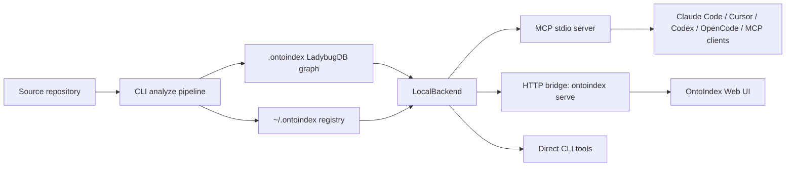

# OntoIndex

**Graph-powered code intelligence for AI agents.** OntoIndex indexes a codebase into a local knowledge graph, then exposes precise code search, symbol context, blast-radius analysis, review helpers, and multi-repo navigation through the Model Context Protocol (MCP), CLI, and web UI.

> Important: OntoIndex has no official cryptocurrency, token, or coin. Any token using the OntoIndex name is not affiliated with this project or its maintainers.


[](https://www.gnu.org/licenses/agpl-3.0.html)
[](https://github.com/ontograph/ontoindex)

- **Current release:** `1.9.1`
 
- **Enterprise:** [erasyuk@gmail.com](erasyuk@gmail.com)
  

## Why OntoIndex

AI coding agents are fast, but they often operate from partial file snippets. They can rename a function without seeing downstream callers, edit a service without understanding cross-file routes, or miss architectural coupling hidden outside the prompt.

OntoIndex gives agents a precomputed graph of the repository:

- **Symbols:** functions, classes, methods, interfaces, files, communities
- **Relations:** imports, calls, inheritance, implementation, membership, execution flow
- **Search:** BM25, semantic retrieval, reciprocal-rank fusion, typed queries
- **Safety:** impact analysis, diff-to-symbol mapping, review reports, audit workflows
- **Local-first:** indexes live in `.ontoindex/`; the MCP server reads local graph data

The result is a smaller, more reliable context surface: agents ask the graph instead of repeatedly scanning the tree.

## Quick Start

```bash
curl -fsSL https://raw.githubusercontent.com/ontograph/ontoindex/master/scripts/install-ontoindex-latest.sh | bash

ontoindex --version

# Run from the repository you want to index.
  ontoindex analyze

# Configure MCP clients once.
  ontoindex setup

# Start the MCP server manually when needed.
  ontoindex mcp

```

To always install the latest GitHub release tarball:

```bash
./scripts/install-ontoindex-latest.sh
```

If you run `ontoindex setup` or `ontoindex mcp` from a helper checkout (for example, a global Codex/Claude installation), set the target project hint explicitly so startup can validate selection against the intended repo:

```bash
 
  cd /path/to/target/repo

  ONTOINDEX_MCP_PROJECT_CWD="$PWD" \
  ONTOINDEX_MCP_REPO="$PWD" \
  ontoindex setup

  ONTOINDEX_MCP_PROJECT_CWD="$PWD" \
  ONTOINDEX_MCP_REPO="$PWD" \
  ontoindex mcp --repo my-project

```

Startup prints both the executable cwd and project path, and will error loudly when `ONTOINDEX_MCP_REPO` or `--repo` points outside the configured `ONTOINDEX_MCP_PROJECT_CWD` unless `ONTOINDEX_MCP_ALLOW_REPO_MISMATCH=1`.

For the browser UI:

```bash
npx -y ontoindex@1.9.1 serve
```

Then open [ontoindex.vercel.app](https://ontoindex.vercel.app). The UI detects the local backend at `http://localhost:4747` and can browse indexed repositories without uploading code.

## MCP Setup

`ontoindex setup` configures supported MCP clients automatically. Manual examples:

### Claude Code

```bash
claude mcp add ontoindex -- npx -y ontoindex@1.9.1 mcp
```

### Codex

```bash
codex mcp add ontoindex -- npx -y ontoindex@1.9.1 mcp
```

### Cursor

Add this to `~/.cursor/mcp.json`:

```json
{
  "mcpServers": {
    "ontoindex": {
      "command": "npx",
      "args": ["-y", "ontoindex@1.9.1", "mcp"]
    }
  }
}
```

### OpenCode

Add this to `~/.config/opencode/config.json`:

```json
{
  "mcp": {
    "ontoindex": {
      "type": "local",
      "command": ["npx", "-y", "ontoindex@1.9.1", "mcp"]
    }
  }
}
```

## Editor Support

| Client | MCP | Skills | Hooks | Notes |
| --- | --- | --- | --- | --- |
| Claude Code | Yes | Yes | Yes | Deepest integration: MCP tools, generated skills, and optional hooks |
| Cursor | Yes | Yes | No | Global MCP config works across projects |
| Codex | Yes | Yes | No | Use `codex mcp add` or `.codex/config.toml` |
| Windsurf | Yes | No | No | Standard MCP server connection |
| OpenCode | Yes | Yes | No | Standard local MCP process |
| Any MCP client | Yes | Client-dependent | Client-dependent | Uses the stdio MCP server |

## How OntoIndex Compares

This is a functionality comparison, not a benchmark. It focuses on what each tool is designed to do at runtime.

| Capability | **OntoIndex** | **GitNexus** | [Graphify](https://github.com/safishamsi/graphify) | [CodeGPT Deep Graph MCP](https://github.com/JudiniLabs/mcp-code-graph) | [code-graph-mcp](https://github.com/sdsrss/code-graph-mcp) | [Optave Codegraph](https://github.com/optave/ops-codegraph-tool) | [CodeGraphContext](https://github.com/CodeGraphContext/CodeGraphContext) | [Serena](https://github.com/oraios/serena) | [Graphiti MCP](https://github.com/getzep/graphiti/blob/main/mcp_server/README.md) |
| --- | --- | --- | --- | --- | --- | --- | --- | --- | --- |
| Primary job | Agent code-intelligence platform | Donor/predecessor for OntoIndex | Turn mixed project folders into queryable knowledge graphs and reports | Query CodeGPT/DeepGraph-hosted repo graphs | Local AST graph MCP for coding assistants | Local function dependency graph and metrics | Local code graph context server and CLI | IDE-like symbolic code agent | Temporal knowledge graph memory |
| Local repository indexing | Yes | Yes | Yes | No; graph is CodeGPT/DeepGraph-hosted | Yes | Yes | Yes | Uses local language tooling, not a precomputed graph index in the same way | No; stores facts/events, not source-code structure |
| Hosted account required | No | No | No for local generation | Yes for private CodeGPT graphs; public DeepGraph URLs also supported | No | No | No | No | Usually needs Neo4j/service setup |
| Persistent graph store | LadybugDB under `.ontoindex/` plus registry | Legacy local graph | Export artifacts such as graph/report/visualization outputs | Hosted DeepGraph/CodeGPT graph | Local AST graph store | SQLite-backed graph | Local graph database/context store | Project memories plus language-server state | Neo4j-backed temporal graph |
| MCP surface | 60+ facade and `gn_*` tools: search, inspect, impact, audit, docs, refactor, systems checks | Earlier MCP concepts | Optional/adjacent MCP output, not the main persistent runtime | MCP tools for hosted graph retrieval and connection exploration | MCP search, call graph, route tracing, impact | MCP graph/metric tools | MCP context/query tools | MCP-style agent tools for symbols, references, edits, memory | MCP tools for entity/relation memory |
| Impact / blast-radius analysis | Yes: symbol, route, diff, batch, process, test-aware signals | Partial predecessor capability | Report/artifact-oriented, not the same live pre-edit gate | Limited to hosted graph relationships | Yes | Yes | Yes/partial depending on indexed graph | References and edits through symbolic tooling, not graph-wide process analysis | Not source-code impact focused |
| Safe refactor / rename | Yes: graph-aware rename/refactor wrappers with dry-run and verification guidance | Partial predecessor capability | No; primarily graph/report generation | No | Limited/analysis-oriented | Limited/analysis-oriented | Limited/analysis-oriented | Yes for symbolic edit workflows | No |
| Docs / requirements evidence | Yes: docs readiness, trace, drift, context, sidecar status | No current public successor surface | Strong for multimodal docs ingestion, but not OntoIndex-style requirement trace gates | No | Limited | Limited | Limited | Memory notes, not docs/code drift gates | Strong memory facts, not repo docs drift |
| Audit lifecycle | Yes: ingest, verify, lint, dedupe, bundle, dispatch, worker review, tombstones | No current public successor surface | Produces reviewable graph/report artifacts | No | No dedicated lifecycle | CI/quality gates and metrics, not OntoIndex audit sessions | No dedicated lifecycle | No dedicated lifecycle | No source-code audit lifecycle |
| Systems-audit checks | Yes: resource trace, path verify, boundary trace, FSM, error topology, concurrency, taint, ABI, fault simulation | No current public successor surface | No | No | Route/call/impact oriented | Architecture/quality oriented | Context oriented | Symbolic navigation/editing | Temporal KG operations |
| Multi-repo registry / target safeguards | Yes: named repo registry, target repo validation, repoPath reporting | Earlier basis | Project/folder oriented | Hosted graph selection | Mostly single workspace | Mostly local workspace | Local workspace | Project oriented | Global memory graph oriented |
| Web/API bridge | Yes: HTTP API plus React/Vite UI | No current public successor surface | Generates visual artifacts | Hosted/web graph experience through DeepGraph | MCP/server focused | CLI/MCP focused | Playground/visual exploration reported by project | Agent tooling focused | Graph service/admin tooling |
| Multimodal project knowledge | Code, docs, requirements, APIs; not a general image/video graph | Code-focused | Strong: code, docs, PDFs, images, videos/web assets depending on setup | Hosted code graph | Code-focused | Code-focused | Code-focused | Code + project memories | General facts/events memory |
| Best fit | Local agent workflows that need graph evidence, safety gates, audits, and release checks | Historical migration source | Generating browsable/project knowledge artifacts across mixed content | Teams already using CodeGPT/DeepGraph hosted graphs | Lightweight local AST graph MCP | Function-level dependency metrics and CI-style graph checks | Local context server for assistant retrieval | Precise symbolic navigation and code edits | Long-lived temporal memory across entities/events |

Practical differences:

- Choose **OntoIndex** when the agent must make edit/release decisions from local graph evidence: impact, diff review, docs drift, audit bundles, and MCP target safeguards.
- Choose **Graphify** when the main goal is a broad project knowledge graph over mixed artifacts, especially docs/PDFs/images/video plus human-readable graph reports.
- Choose **CodeGPT Deep Graph MCP** when the graph already lives in CodeGPT/DeepGraph and the MCP client should query that hosted graph rather than build a local index.
- Choose **code-graph-mcp**, **Optave Codegraph**, or **CodeGraphContext** for smaller local graph servers focused on AST/call/dependency context without OntoIndex's audit lifecycle and docs evidence model.
- Choose **Serena** when language-server style symbolic edits and project memories matter more than a precomputed repository graph.
- Choose **Graphiti MCP** for temporal memory over facts/events; it is complementary to OntoIndex rather than a source-code index replacement.

## What the Agent Gets

Core MCP tools:

| Tool | Purpose |
| --- | --- |
| `list_repos` | Discover indexed repositories |
| `query` | Process-grouped hybrid search |
| `context` | Symbol-centric callers, callees, references, and process participation |
| `impact` | Blast-radius analysis before edits |
| `detect_changes` | Map Git diff hunks to affected symbols and execution flows |
| `rename` | Coordinated multi-file rename with graph and text-search evidence |
| `cypher` | Raw graph queries for advanced users |

Higher-level surfaces:

- **Docs:** requirement tracing, docs drift, docs context, readiness reports
- **Review:** graph-aware diff review and pre-commit audit
- **Audit lifecycle:** ingest, verify, lint, bundle, and dispatch audit findings
- **Systems audit:** resource tracing, path verification, test suggestions, taint-style heuristics
- **Resources:** `ontoindex://repos`, repo context, clusters, processes, schema, memories, onboarding
- **Generated skills:** repository-specific `.claude/skills/generated/*/SKILL.md` files with module-level context

## Functional Architecture

OntoIndex has three runtime entry points over the same local graph backend:



| Component | Code | Responsibility |
| --- | --- | --- |
| CLI command layer | [`ontoindex/src/cli/`](ontoindex/src/cli/) | User-facing commands: `analyze`, `mcp`, `serve`, `query`, `impact`, `review`, `docs`, `audit`, `group` |
| Ingestion pipeline | [`ontoindex/src/core/ingestion/`](ontoindex/src/core/ingestion/) | File walk, Tree-sitter parsing, import/call/type/heritage resolution, route/tool/ORM extraction |
| Pipeline phase DAG | [`ontoindex/src/core/ingestion/pipeline-phases/`](ontoindex/src/core/ingestion/pipeline-phases/) | Ordered graph build phases: scan, structure, markdown, parse, routes, tools, ORM, cross-file, MRO, communities, processes |
| Graph storage | [`ontoindex/src/core/lbug/`](ontoindex/src/core/lbug/) | LadybugDB schema, graph loading, query execution, embedding persistence |
| Repository registry | [`ontoindex/src/storage/`](ontoindex/src/storage/) | `.ontoindex/` metadata, global `~/.ontoindex/registry.json`, stale-index checks |
| Search and ranking | [`ontoindex/src/core/search/`](ontoindex/src/core/search/) | BM25, semantic retrieval, intent routing, Reciprocal Rank Fusion, repomap context |
| Embeddings | [`ontoindex/src/core/embeddings/`](ontoindex/src/core/embeddings/) | Optional local embedding generation and incremental embedding reuse |
| MCP backend | [`ontoindex/src/mcp/`](ontoindex/src/mcp/) | MCP server, resources, facade tools, `gn_*` super-functions, local backend dispatch |
| HTTP backend | [`ontoindex/src/server/`](ontoindex/src/server/) | Express API used by the browser UI and local bridge mode |
| Web UI | [`ontoindex-web/src/`](ontoindex-web/src/) | Graph explorer, repository browser, local backend connection, AI chat UI |
| Shared contracts | [`ontoindex-shared/src/`](ontoindex-shared/src/) | Shared language IDs, API types, and client/server constants |
| Native helpers | [`ontoindex-native/`](ontoindex-native/) | Optional native acceleration and extraction helpers |
| Agent integration assets | [`ontoindex-claude-plugin/`](ontoindex-claude-plugin/), [`ontoindex-cursor-integration/`](ontoindex-cursor-integration/) | Skills, hooks, and editor-specific packaging |
| Evaluation harness | [`eval/`](eval/) | Benchmarks and agent/tool evaluation workflows |

### Data Model

The graph is stored in `.ontoindex/` inside each indexed repository. A global registry under `~/.ontoindex/` lets one MCP server serve many repositories.

| Graph entity | Examples |
| --- | --- |
| Nodes | `File`, `Folder`, `Function`, `Class`, `Interface`, `Method`, `Property`, `Community`, `Process`, `Route`, `Tool`, `Section`, `Embedding` |
| Relations | `CONTAINS`, `DEFINES`, `CALLS`, `IMPORTS`, `EXTENDS`, `IMPLEMENTS`, `HAS_METHOD`, `HAS_PROPERTY`, `ACCESSES`, `MEMBER_OF`, `STEP_IN_PROCESS`, `HANDLES_ROUTE`, `HANDLES_TOOL` |
| Derived structures | Functional communities, execution processes, route maps, tool maps, contract bridges, markdown/doc evidence, advisory memories |

### Request Flow

| Request | Flow |
| --- | --- |
| `ontoindex analyze` | CLI scans the repository, runs the ingestion DAG, writes LadybugDB tables, saves metadata, and registers the repo globally |
| MCP `search` / `query` | Agent calls MCP stdio server, `LocalBackend` opens the indexed repo, search combines BM25/vector/graph signals, response is grouped by process |
| MCP `impact` / `gn_safe_edit_check` | Backend resolves a symbol or diff, traverses upstream/downstream graph edges, adds process/test/co-change evidence, and returns a risk verdict |
| `ontoindex serve` + web UI | HTTP server exposes the same backend to the browser UI, so large repos use local indexes instead of browser-only memory |
| Multi-repo groups | Group config links multiple indexed repos; contract extraction and cross-impact use service boundaries and exported contracts |

For implementation details, see [ARCHITECTURE.md](ARCHITECTURE.md).

## CLI Commands

```bash
ontoindex setup                         # Configure MCP clients
ontoindex analyze [path]                # Index a repository
ontoindex analyze --force               # Full re-index
ontoindex analyze --skills              # Generate repo-specific skills
ontoindex analyze --embeddings          # Enable semantic embeddings
ontoindex index [path...]               # Register existing .ontoindex folders
ontoindex serve                         # Start local HTTP backend for web UI
ontoindex mcp                           # Start stdio MCP server
ontoindex list                          # List indexed repositories
ontoindex status                        # Show current repo index status
ontoindex clean                         # Delete current repo index
ontoindex wiki [path]                   # Generate repo wiki from graph
ontoindex query "authentication flow"   # Search execution flows and symbols
ontoindex context validateUser          # Callers, callees, refs, processes
ontoindex impact validateUser           # Blast-radius analysis
ontoindex detect-changes                # Analyze current Git diff
ontoindex cypher "MATCH (n) RETURN n LIMIT 5"
ontoindex review diff                   # Graph-aware local diff review
ontoindex audit                         # Structured audit report
ontoindex docs readiness                # Docs evidence readiness
ontoindex group create <name>           # Multi-repo group
ontoindex group sync <name>             # Cross-repo contract extraction
```

Run `ontoindex --help` or `ontoindex <command> --help` for the full command surface.

## Indexing Pipeline

OntoIndex builds the graph through a typed phase DAG:

```text
scan -> structure -> [markdown, cobol] -> parse -> [routes, tools, orm]
  -> crossFile -> mro -> communities -> processes
```

The key functional steps are:

1. **Scan and structure:** walk files, apply repository ignore policy, create folder/file nodes.
2. **Parse:** run Tree-sitter providers in worker threads or sequential fallback, extracting unified symbols and captures.
3. **Resolve:** connect imports, calls, receivers, constructor inference, type hints, heritage, and method-resolution-order edges.
4. **Enrich graph:** extract routes, MCP/RPC tools, ORM queries, markdown sections, docs evidence, communities, and execution processes.
5. **Persist:** load nodes and `CodeRelation` edges into LadybugDB, create text indexes, reuse or generate embeddings.
6. **Expose:** serve the graph through CLI commands, MCP tools/resources, HTTP bridge APIs, and the web UI.

Supported language coverage includes TypeScript, JavaScript, Python, Java, Kotlin, C#, Go, Rust, PHP, Ruby, Swift, C, C++, Dart, and protobuf-related parser support. Depth varies by language, but the core model is consistent: symbols, files, relationships, communities, and execution flows.

## Repository Layout

| Path | Purpose |
| --- | --- |
| [`ontoindex/`](ontoindex/) | CLI, indexing pipeline, MCP server, graph logic |
| [`ontoindex-web/`](ontoindex-web/) | React/Vite web UI |
| [`ontoindex-shared/`](ontoindex-shared/) | Shared TypeScript types/constants |
| [`ontoindex-native/`](ontoindex-native/) | Optional native helpers |
| [`ontoindex-claude-plugin/`](ontoindex-claude-plugin/) | Claude integration assets |
| [`ontoindex-cursor-integration/`](ontoindex-cursor-integration/) | Cursor integration assets |
| [`eval/`](eval/) | Evaluation harness |
| [`docs/`](docs/) | Documentation index, ADRs, guides, reference docs, code-indexing notes |

## Development

```bash
cd ontoindex
npm install
npm run build
npm run test:unit
```

Useful docs:

- [ARCHITECTURE.md](ARCHITECTURE.md)
- [RUNBOOK.md](RUNBOOK.md)
- [GUARDRAILS.md](GUARDRAILS.md)
- [CONTRIBUTING.md](CONTRIBUTING.md)
- [TESTING.md](TESTING.md)
- [docs/README.md](docs/README.md)
- [docs/adr/0000-index.md](docs/adr/0000-index.md)
- [docs/reference/mcp.md](docs/reference/mcp.md)

## Web UI

Use the hosted UI at [ontoindex.vercel.app](https://ontoindex.vercel.app), or run it locally:

```bash
cd ontoindex-shared && npm install && npm run build
cd ../ontoindex-web && npm install && npm run dev
```

The browser-only mode can inspect uploaded ZIPs in memory. For larger repositories, run `ontoindex serve` and let the UI connect to the local backend.

## Docker

```bash
docker compose up -d
```

Images:

| Image | Purpose |
| --- | --- |
| `ghcr.io/ontograph/ontoindex:1.9.1` | CLI, MCP, and `ontoindex serve` backend |
| `ghcr.io/ontograph/ontoindex-web:1.9.1` | Web UI |

The compose stack exposes:

- Backend: `http://localhost:4747`
- Web UI: `http://localhost:4173`

## Release Integrity

Stable Docker images are intended to match npm package versions. For `1.9.1`:

```bash
cosign verify ghcr.io/ontograph/ontoindex:1.9.1 \
  --certificate-identity-regexp '^https://github\.com/ontograph/ontoindex/\.github/workflows/docker\.yml@refs/tags/v[0-9]+\.[0-9]+\.[0-9]+(-[a-zA-Z0-9.]+)?$' \
  --certificate-oidc-issuer https://token.actions.githubusercontent.com
```

Kubernetes policy example:

- [deploy/kubernetes/cluster-image-policy.yaml](deploy/kubernetes/cluster-image-policy.yaml)

## Security And Privacy

- CLI/MCP indexing is local by default.
- Repository indexes are stored in `.ontoindex/`.
- The global registry stores repository paths and metadata under the user profile.
- Browser-only mode keeps code in the browser session.
- Enterprise deployments can be self-hosted.

Report security issues through [SECURITY.md](SECURITY.md).

## Community Integrations

| Project | Description |
| --- | --- |
| [pi-ontoindex](https://github.com/tintinweb/pi-ontoindex) | OntoIndex plugin for [pi](https://pi.dev) |
| [ontoindex-stable-ops](https://github.com/ShunsukeHayashi/ontoindex-stable-ops) | Stable ops and deployment workflows |

Open a pull request to add maintained integrations.

## Source And Donor Acknowledgments

OntoIndex includes code originally developed as **GitNexus**. Copyright and attribution for GitNexus contributors are preserved in [NOTICE](NOTICE).

The project also builds on open source components and donated ecosystem work from upstream maintainers, including:

- [Model Context Protocol](https://modelcontextprotocol.io/)
- [Tree-sitter](https://tree-sitter.github.io/tree-sitter/)
- [LadybugDB](https://ladybugdb.com/)
- [Graphology](https://graphology.github.io/)
- [Sigma.js](https://www.sigmajs.org/)
- [Transformers.js](https://huggingface.co/docs/transformers.js)

See [NOTICE](NOTICE) for preserved attribution and third-party component notices.

## License

AGPL-3.0-or-later. See [LICENSE](LICENSE).
