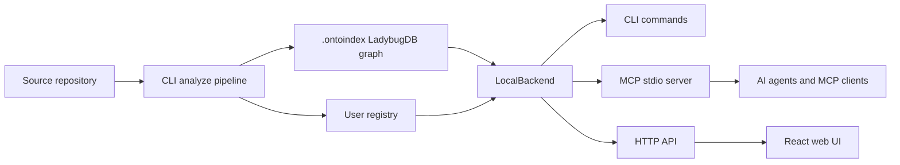

# OntoIndex

**Графовая code intelligence для AI-агентов.** OntoIndex строит локальный граф кода для репозитория и открывает его через CLI, MCP-сервер, HTTP API и браузерный интерфейс.

> Важно: у OntoIndex нет официальной криптовалюты, токена или монеты. Любой токен с именем OntoIndex не связан с проектом и его сопровождающими.

[](https://www.gnu.org/licenses/agpl-3.0.html)
[](https://github.com/ontograph/ontoindex)

- Текущий релиз: `1.9.3`
- Исходный репозиторий: [github.com/ontograph/ontoindex](https://github.com/ontograph/ontoindex)
- Политика безопасности: [SECURITY.md](SECURITY.md)
- Enterprise-контакт: [erasyuk@gmail.com](mailto:erasyuk@gmail.com)
- Языки: [English](README.md) · [简体中文](README.zh-CN.md)

## Аннотация

AI-агенты для разработки часто работают с небольшими фрагментами кодовой базы. Это быстро, но рискованно: модель может изменить функцию, не увидев вызывающий код, переименовать символ без анализа последствий или пропустить архитектурную связь за пределами текущего контекста.

OntoIndex снижает этот риск за счет предварительно построенного графа репозитория. Граф хранит файлы, символы, импорты, вызовы, наследование, маршруты, инструменты, разделы документации, сообщества модулей и потоки выполнения. Перед правкой агент может спросить граф: где используется символ, в каком процессе он участвует, какие тесты рядом и какие изменения выглядят рискованными.

Индекс локальный по умолчанию. Данные репозитория лежат в `.ontoindex/`, а глобальный реестр в `~/.ontoindex/` хранит только метаданные и пути к проиндексированным репозиториям.

## Что дает OntoIndex

| Область | Возможности |
| --- | --- |
| Граф кода | Файлы, папки, функции, классы, методы, интерфейсы, свойства, маршруты, инструменты, разделы документации и узлы процессов |
| Связи | `CONTAINS`, `DEFINES`, `CALLS`, `IMPORTS`, `EXTENDS`, `IMPLEMENTS`, `MEMBER_OF`, `STEP_IN_PROCESS`, `HANDLES_ROUTE` и связанные ребра |
| Поиск | BM25, поиск по графу, опциональный семантический поиск, reciprocal-rank fusion и результаты, сгруппированные по процессам |
| Безопасность агента | Impact analysis, сопоставление diff с символами, pre-commit audit, review-помощники и проверка целевого репозитория |
| Интерфейсы | CLI, MCP stdio server, HTTP API, генерируемая wiki, генерируемые skills и React/Vite web UI |
| Multi-repo | Именованный реестр репозиториев, repo labels, group contracts и cross-repo контекст |

## Установка

### Сторонние зависимости

OntoIndex работает на Node.js и использует native parser packages для части языков. Установите зависимости до установки OntoIndex.

| Требование | Linux | Windows |
| --- | --- | --- |
| Node.js | Node.js `20` или новее и `npm` | Node.js `20` или новее и `npm` |
| Git | `git` CLI для метаданных репозитория и анализа diff | Git for Windows |
| Native build tools | `python3`, `make`, `g++` для опциональных native parser builds | Python 3 и Microsoft C++ Build Tools из Visual Studio Build Tools |
| Shell | `bash` для install-script примеров | PowerShell 5.1 или PowerShell 7 |
| Контейнеры, опционально | Docker Engine и Docker Compose | Docker Desktop |

Проверка в Linux:

```bash
node --version
npm --version
git --version
python3 --version
make --version
g++ --version
```

Проверка в Windows PowerShell:

```powershell
node --version
npm --version
git --version
python --version
npm config get msvs_version
```

### Установка последнего GitHub-релиза

Linux и macOS:

```bash
curl -fsSL https://raw.githubusercontent.com/ontograph/ontoindex/master/scripts/install-ontoindex-latest.sh | bash
ontoindex --version
```

Windows PowerShell:

```powershell
iwr -useb https://raw.githubusercontent.com/ontograph/ontoindex/master/scripts/install-ontoindex-latest.ps1 | iex
ontoindex --version
```

Из локального checkout:

| Платформа | Команда |
| --- | --- |
| Linux/macOS | `./scripts/install-ontoindex-latest.sh` |
| Windows PowerShell | `powershell -ExecutionPolicy Bypass -File .\scripts\install-ontoindex-latest.ps1` |

Скрипты получают последний GitHub-релиз, находят asset `ontoindex-*.tgz` и устанавливают его через `npm install -g`. Если глобальный install prefix недоступен для записи, скрипт использует user npm prefix.

Настройки installer:

| Цель | Linux/macOS | Windows PowerShell |
| --- | --- | --- |
| Другой release repo | `ONTOINDEX_GITHUB_REPO=owner/repo ./scripts/install-ontoindex-latest.sh` | `$env:ONTOINDEX_GITHUB_REPO='owner/repo'; .\scripts\install-ontoindex-latest.ps1` |
| User npm prefix | `ONTOINDEX_NPM_PREFIX="$HOME/.local" ./scripts/install-ontoindex-latest.sh` | `$env:ONTOINDEX_NPM_PREFIX="$env:APPDATA\npm"; .\scripts\install-ontoindex-latest.ps1` |
| Принудительно user prefix | `ONTOINDEX_NPM_PREFIX="$HOME/.local" ./scripts/install-ontoindex-latest.sh` | `.\scripts\install-ontoindex-latest.ps1 -ForceUserPrefix` |

### Установка через npm

Используйте этот путь, если публикация в npm доступна в вашей среде.

| Платформа | Команда |
| --- | --- |
| Linux/macOS | `npm install -g ontoindex@1.9.3 && ontoindex --version` |
| Windows PowerShell | `npm install -g ontoindex@1.9.3; ontoindex --version` |

### Установка из release tarball URL

Используйте этот вариант, когда нужен неизменяемый GitHub release asset.

| Платформа | Команда |
| --- | --- |
| Linux/macOS | `npm install -g https://github.com/ontograph/ontoindex/releases/download/v1.9.3/ontoindex-1.9.3.tgz && ontoindex --version` |
| Windows PowerShell | `npm install -g https://github.com/ontograph/ontoindex/releases/download/v1.9.3/ontoindex-1.9.3.tgz; ontoindex --version` |

## Первый запуск

Запускайте OntoIndex из репозитория, который хотите индексировать.

| Задача | Linux/macOS | Windows PowerShell |
| --- | --- | --- |
| Индексировать текущий репозиторий | `ontoindex analyze` | `ontoindex analyze` |
| Проверить статус индекса | `ontoindex status` | `ontoindex status` |
| Настроить поддерживаемые MCP-клиенты | `ontoindex setup` | `ontoindex setup` |
| Запустить MCP server вручную | `ontoindex mcp` | `ontoindex mcp` |
| Запустить локальный HTTP backend | `ontoindex serve` | `ontoindex serve` |
| Сгенерировать wiki | `ontoindex wiki . --out docs/wiki` | `ontoindex wiki . --out docs/wiki` |

Если executable OntoIndex запущен из helper checkout или global tool path, явно задайте целевой репозиторий, чтобы MCP server не обслуживал другой проект.

Linux/macOS:

```bash
cd /path/to/target/repo
export ONTOINDEX_MCP_PROJECT_CWD="$PWD"
export ONTOINDEX_MCP_REPO="$PWD"
ontoindex setup
ontoindex mcp --repo my-project
```

Windows PowerShell:

```powershell
Set-Location C:\path\to\target\repo
$env:ONTOINDEX_MCP_PROJECT_CWD = (Get-Location).Path
$env:ONTOINDEX_MCP_REPO = (Get-Location).Path
ontoindex setup
ontoindex mcp --repo my-project
```

При старте OntoIndex печатает рабочую директорию executable и путь к целевому проекту. Если `ONTOINDEX_MCP_REPO` или `--repo` указывает за пределы `ONTOINDEX_MCP_PROJECT_CWD`, startup завершается ошибкой, если не задано `ONTOINDEX_MCP_ALLOW_REPO_MISMATCH=1`.

## MCP Setup

`ontoindex setup` автоматически настраивает поддерживаемые MCP-клиенты. Ручные примеры полезны для отладки и клиентов без auto-setup.

| Клиент | Linux/macOS | Windows PowerShell |
| --- | --- | --- |
| Claude Code | `claude mcp add ontoindex -- ontoindex mcp` | `claude mcp add ontoindex -- ontoindex mcp` |
| Codex | `codex mcp add ontoindex -- ontoindex mcp` | `codex mcp add ontoindex -- ontoindex mcp` |
| Любой MCP client | command: `ontoindex`, args: `["mcp"]` | command: `ontoindex`, args: `["mcp"]` |

Cursor:

```json
{
  "mcpServers": {
    "ontoindex": {
      "command": "ontoindex",
      "args": ["mcp"]
    }
  }
}
```

OpenCode:

```json
{
  "mcp": {
    "ontoindex": {
      "type": "local",
      "command": ["ontoindex", "mcp"]
    }
  }
}
```

## Типовые workflow агента

| Цель | Linux/macOS | Windows PowerShell |
| --- | --- | --- |
| Найти execution flow | `ontoindex query "authentication flow"` | `ontoindex query "authentication flow"` |
| Посмотреть контекст символа | `ontoindex ctx validateUser` | `ontoindex ctx validateUser` |
| Проверить blast radius | `ontoindex impact validateUser --include-tests --depth 2` | `ontoindex impact validateUser --include-tests --depth 2` |
| Проверить текущий diff | `ontoindex review diff` | `ontoindex review diff` |
| Audit перед commit | `ontoindex detect-changes` | `ontoindex detect-changes` |
| Полная переиндексация | `ontoindex analyze --force` | `ontoindex analyze --force` |

Основные MCP-поверхности:

| Семейство инструментов | Для чего используется |
| --- | --- |
| Search and context | Поиск релевантных символов, файлов, routes и процессов |
| Impact analysis | Оценка upstream/downstream blast radius перед правками |
| Diff review | Сопоставление измененных hunks с символами графа и execution flows |
| Docs evidence | Проверка traceability требований, docs drift и readiness |
| Refactor support | Graph-aware rename и safety checks вместо простого find-and-replace |
| Systems audit | Анализ resource flow, path boundaries, error topology, concurrency и taint-style signals |

## Функциональная архитектура

OntoIndex имеет три entry point поверх одного локального graph backend.



| Компонент | Путь | Ответственность |
| --- | --- | --- |
| CLI layer | [`ontoindex/src/cli/`](ontoindex/src/cli/) | Команды `analyze`, `mcp`, `serve`, `query`, `impact`, `review`, `docs`, `audit` |
| Ingestion pipeline | [`ontoindex/src/core/ingestion/`](ontoindex/src/core/ingestion/) | File scanning, Tree-sitter parsing, import/call/type resolution, route/tool/ORM extraction |
| Pipeline phases | [`ontoindex/src/core/ingestion/pipeline-phases/`](ontoindex/src/core/ingestion/pipeline-phases/) | Упорядоченные фазы построения графа от scan до process extraction |
| Graph storage | [`ontoindex/src/core/lbug/`](ontoindex/src/core/lbug/) | LadybugDB schema, graph loading, query execution, embedding persistence |
| Registry | [`ontoindex/src/storage/`](ontoindex/src/storage/) | `.ontoindex/` metadata, global registry, stale-index checks |
| Search | [`ontoindex/src/core/search/`](ontoindex/src/core/search/) | BM25, semantic retrieval, intent routing, ranking, repository-map context |
| MCP backend | [`ontoindex/src/mcp/`](ontoindex/src/mcp/) | MCP resources, facade tools, `gn_*` workflows, local backend dispatch |
| HTTP backend | [`ontoindex/src/server/`](ontoindex/src/server/) | Express API для browser UI и local bridge mode |
| Web UI | [`ontoindex-web/src/`](ontoindex-web/src/) | Graph explorer, repository browser, backend connection, AI chat UI |
| Shared contracts | [`ontoindex-shared/src/`](ontoindex-shared/src/) | Общие API-типы, language identifiers и constants |

### Индексационный pipeline

Построение графа идет через typed phase DAG:

```text
scan -> structure -> [markdown, cobol] -> parse -> [routes, tools, orm]
  -> crossFile -> mro -> communities -> processes
```

Основные шаги:

1. Сканирование файлов с учетом ignore rules репозитория.
2. Парсинг поддерживаемых языков через Tree-sitter providers.
3. Разрешение imports, calls, receivers, constructors, type hints, inheritance и method-resolution-order edges.
4. Обогащение графа routes, MCP/RPC tools, ORM queries, markdown sections, communities и execution flows.
5. Сохранение nodes и relations в LadybugDB под `.ontoindex/`.
6. Экспорт одного и того же графа через CLI, MCP, HTTP, web UI, generated wiki и generated skills.

Глубина поддержки зависит от языка, но общая модель покрывает TypeScript, JavaScript, Python, Java, Kotlin, C#, Go, Rust, PHP, Ruby, Swift, C, C++, Dart и protobuf-related parser support.

## Web UI

Hosted UI может подключаться к локальному backend `http://localhost:4747`.

| Задача | Linux/macOS | Windows PowerShell |
| --- | --- | --- |
| Запустить local backend | `ontoindex serve` | `ontoindex serve` |
| Открыть hosted UI | `xdg-open https://ontoindex.vercel.app` | `Start-Process https://ontoindex.vercel.app` |

Запуск web UI из исходников:

| Платформа | Команда |
| --- | --- |
| Linux/macOS | `cd ontoindex-shared && npm install && npm run build && cd ../ontoindex-web && npm install && npm run dev` |
| Windows PowerShell | `Set-Location ontoindex-shared; npm install; npm run build; Set-Location ..\ontoindex-web; npm install; npm run dev` |

Browser-only mode может анализировать загруженные ZIP-файлы в памяти. Для больших репозиториев запускайте `ontoindex serve`, чтобы UI использовал локальный index.

## Docker

| Задача | Linux/macOS | Windows PowerShell |
| --- | --- | --- |
| Запустить stack | `docker compose up -d` | `docker compose up -d` |
| Backend URL | `http://localhost:4747` | `http://localhost:4747` |
| Web UI URL | `http://localhost:4173` | `http://localhost:4173` |

Images:

| Image | Назначение |
| --- | --- |
| `ghcr.io/ontograph/ontoindex:1.9.3` | CLI, MCP server и `ontoindex serve` backend |
| `ghcr.io/ontograph/ontoindex-web:1.9.3` | Web UI |

## Сравнение с похожими инструментами

Таблица сравнивает функциональный объем, а не скорость.

| Возможность | OntoIndex | GitNexus | Graphify | CodeGPT Deep Graph MCP | code-graph-mcp / Optave / CodeGraphContext | Serena | Graphiti MCP |
| --- | --- | --- | --- | --- | --- | --- | --- |
| Основная роль | Локальный слой code intelligence и safety для агентов | Исторический donor/predecessor | Широкий project knowledge graph и reports | MCP-доступ к hosted CodeGPT/DeepGraph data | Легкие local code graph servers | Symbolic code agent with memory | Temporal entity/relation memory |
| Локальная индексация source | Да | Да | Да | Нет, hosted graph | Да | Использует language tooling, не ту же persistent graph model | Нет, хранит facts/events |
| Persistent repository graph | `.ontoindex/` LadybugDB плюс registry | Legacy local graph | Exported graph/report artifacts | Hosted graph | Local AST/dependency stores | Project memories и language-server state | Neo4j-backed temporal graph |
| MCP runtime | 60+ facade и `gn_*` tools | Ранние concepts | Adjacent, artifact-focused | Hosted graph query tools | Search/call/impact tools | Agent tools for symbols and edits | Entity/relation memory tools |
| Impact analysis | Symbol, route, diff, process, test-aware signals | Частично | Report-oriented | Только relationship queries | Частично/сильно, зависит от проекта | Reference-based symbolic checks | Не сфокусирован на source-code |
| Refactor safety | Graph-aware rename и verification guidance | Частично | Нет | Нет | В основном analysis-oriented | Сильные symbolic edits | Нет |
| Docs evidence | Requirements trace, drift checks, readiness reports | Нет текущей public successor surface | Сильная mixed-document ingestion | Нет | Limited | Notes and memories | Memory facts, не repo docs drift |
| Лучший сценарий | Local editing и release workflows, где агенту нужна graph evidence | Migration context | Human-readable project knowledge artifacts | Команды уже используют CodeGPT-hosted graphs | Малые AST/call graph MCP задачи | Precise symbolic editing | Long-lived non-code memory |

Практическое правило:

- Выбирайте OntoIndex, когда агент должен редактировать или выпускать релиз на основе локальных evidence: impact, diff review, docs drift, audit workflows и target-repository safeguards.
- Выбирайте Graphify, когда главный результат — широкий human-readable project knowledge graph по смешанным артефактам.
- Выбирайте CodeGPT Deep Graph MCP, когда граф уже живет в CodeGPT/DeepGraph.
- Выбирайте небольшие code-graph MCP servers, когда нужен только AST/call/dependency lookup без broader audit lifecycle.
- Выбирайте Serena для language-server style symbolic edits.
- Выбирайте Graphiti MCP для temporal memory по facts/events; это дополнение к OntoIndex, а не замена source-code index.

## Структура репозитория

| Путь | Назначение |
| --- | --- |
| [`ontoindex/`](ontoindex/) | CLI, indexing pipeline, MCP server, graph logic |
| [`ontoindex-web/`](ontoindex-web/) | React/Vite web UI |
| [`ontoindex-shared/`](ontoindex-shared/) | Общие TypeScript types/constants |
| [`ontoindex-native/`](ontoindex-native/) | Опциональные native helpers |
| [`ontoindex-claude-plugin/`](ontoindex-claude-plugin/) | Claude integration assets |
| [`ontoindex-cursor-integration/`](ontoindex-cursor-integration/) | Cursor integration assets |
| [`docs/`](docs/) | ADRs, guides, generated wiki и references |
| [`eval/`](eval/) | Evaluation harness |

## Разработка

Dev prerequisites те же, что и для установки, плюс package manager и compiler tools для native Node modules.

| Задача | Linux/macOS | Windows PowerShell |
| --- | --- | --- |
| Установить root dependencies | `npm install` | `npm install` |
| Собрать CLI/core | `cd ontoindex && npm install && npm run build` | `Set-Location ontoindex; npm install; npm run build` |
| Запустить unit tests | `cd ontoindex && npm run test:unit` | `Set-Location ontoindex; npm run test:unit` |
| Type-check web UI | `cd ontoindex-web && npx tsc -b --noEmit` | `Set-Location ontoindex-web; npx tsc -b --noEmit` |
| Собрать web UI | `cd ontoindex-web && npm run build` | `Set-Location ontoindex-web; npm run build` |
| Запустить web tests | `cd ontoindex-web && npm test` | `Set-Location ontoindex-web; npm test` |

Полезные документы:

- [ARCHITECTURE.md](ARCHITECTURE.md)
- [RUNBOOK.md](RUNBOOK.md)
- [GUARDRAILS.md](GUARDRAILS.md)
- [CONTRIBUTING.md](CONTRIBUTING.md)
- [TESTING.md](TESTING.md)
- [docs/README.md](docs/README.md)
- [docs/adr/0000-index.md](docs/adr/0000-index.md)
- [docs/ref/mcp.md](docs/ref/mcp.md)

## Security and Privacy

- CLI и MCP indexing локальны по умолчанию.
- Индексы репозиториев хранятся в `.ontoindex/`.
- Глобальный registry хранит paths и metadata репозиториев в user profile.
- Browser-only mode держит загруженный код в browser session.
- Enterprise deployments можно self-host.

Сообщайте о security issues через [SECURITY.md](SECURITY.md).

## Источники и donor acknowledgments

OntoIndex включает код, изначально разработанный как **GitNexus**. Copyright и attribution для GitNexus contributors сохранены в [NOTICE](NOTICE).

Проект также опирается на open-source components и donated ecosystem work upstream maintainers, включая:

- [Model Context Protocol](https://modelcontextprotocol.io/)
- [Tree-sitter](https://tree-sitter.github.io/tree-sitter/)
- [LadybugDB](https://ladybugdb.com/)
- [Graphology](https://graphology.github.io/)
- [Sigma.js](https://www.sigmajs.org/)
- [Transformers.js](https://huggingface.co/docs/transformers.js)

См. [NOTICE](NOTICE) для attribution и notices по third-party components.

## License

OntoIndex распространяется под AGPL-3.0-or-later. См. [LICENSE](LICENSE).
