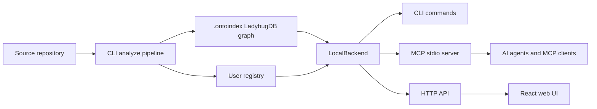

# OntoIndex

**面向 AI Agent 的图驱动代码智能。** OntoIndex 会为代码仓库构建本地代码图，并通过 CLI、MCP 服务器、HTTP API 和浏览器界面提供访问。

> 重要说明：OntoIndex 没有官方加密货币、代币或 coin。任何使用 OntoIndex 名称的代币都与本项目和维护者无关。

[](https://www.gnu.org/licenses/agpl-3.0.html)
[](https://github.com/ontograph/ontoindex)

- 当前版本：`1.9.3`
- 源代码仓库：[github.com/ontograph/ontoindex](https://github.com/ontograph/ontoindex)
- 安全策略：[SECURITY.md](SECURITY.md)
- 企业联系：[erasyuk@gmail.com](mailto:erasyuk@gmail.com)
- 语言：[English](README.md) · [Русский](README.ru.md)

## 摘要

AI 编程 Agent 经常只基于代码库的一小段上下文工作。这种方式很快，但也很脆弱：模型可能在看不到调用方的情况下修改函数，在没有下游影响分析的情况下重命名符号，或者漏掉当前提示之外的架构耦合。

OntoIndex 通过预先构建仓库图来降低这种不确定性。图中记录文件、符号、import、call、继承、route、tool、文档章节、模块社区和执行流程。Agent 在编辑前可以先询问图：这个符号在哪里被使用，它属于哪个流程，附近有哪些测试，哪些修改有风险。

索引默认本地优先。仓库数据存储在 `.ontoindex/` 中，全局注册表 `~/.ontoindex/` 只保存已索引仓库的元数据和路径。

## 功能概览

| 领域 | 能力 |
| --- | --- |
| 代码图 | 文件、目录、函数、类、方法、接口、属性、route、tool、文档章节和流程节点 |
| 关系 | `CONTAINS`, `DEFINES`, `CALLS`, `IMPORTS`, `EXTENDS`, `IMPLEMENTS`, `MEMBER_OF`, `STEP_IN_PROCESS`, `HANDLES_ROUTE` 等边 |
| 搜索 | BM25、图搜索、可选语义检索、reciprocal-rank fusion，以及按流程分组的结果 |
| Agent 安全 | 影响分析、diff 到符号映射、pre-commit audit、review helper 和目标仓库校验 |
| 接口 | CLI、MCP stdio server、HTTP API、生成的 wiki、生成的 skills、React/Vite web UI |
| 多仓库 | 命名仓库注册表、repo label、group contract 和跨仓库上下文 |

## 安装

### 第三方依赖

OntoIndex 运行在 Node.js 上，并且部分语言解析器会使用 native parser package。安装 OntoIndex 前请先安装这些依赖。

| 需求 | Linux | Windows |
| --- | --- | --- |
| Node.js | Node.js `20` 或更新版本，以及 `npm` | Node.js `20` 或更新版本，以及 `npm` |
| Git | 用于仓库元数据和 diff 分析的 `git` CLI | Git for Windows |
| Native build tools | `python3`, `make`, `g++`，用于可选 native parser build | Python 3 和 Visual Studio Build Tools 中的 Microsoft C++ Build Tools |
| Shell | 安装脚本示例使用 `bash` | PowerShell 5.1 或 PowerShell 7 |
| 可选容器环境 | Docker Engine 和 Docker Compose | Docker Desktop |

Linux 检查示例：

```bash
node --version
npm --version
git --version
python3 --version
make --version
g++ --version
```

Windows PowerShell 检查示例：

```powershell
node --version
npm --version
git --version
python --version
npm config get msvs_version
```

### 安装最新 GitHub Release

Linux 和 macOS：

```bash
curl -fsSL https://raw.githubusercontent.com/ontograph/ontoindex/master/scripts/install-ontoindex-latest.sh | bash
ontoindex --version
```

Windows PowerShell：

```powershell
iwr -useb https://raw.githubusercontent.com/ontograph/ontoindex/master/scripts/install-ontoindex-latest.ps1 | iex
ontoindex --version
```

从本地 checkout 安装：

| 平台 | 命令 |
| --- | --- |
| Linux/macOS | `./scripts/install-ontoindex-latest.sh` |
| Windows PowerShell | `powershell -ExecutionPolicy Bypass -File .\scripts\install-ontoindex-latest.ps1` |

安装脚本会读取最新 GitHub release，查找 `ontoindex-*.tgz` asset，并使用 `npm install -g` 安装。如果全局 npm prefix 不可写，会回退到用户级 npm prefix。

安装脚本配置：

| 目的 | Linux/macOS | Windows PowerShell |
| --- | --- | --- |
| 使用其他 release 仓库 | `ONTOINDEX_GITHUB_REPO=owner/repo ./scripts/install-ontoindex-latest.sh` | `$env:ONTOINDEX_GITHUB_REPO='owner/repo'; .\scripts\install-ontoindex-latest.ps1` |
| 使用用户级 npm prefix | `ONTOINDEX_NPM_PREFIX="$HOME/.local" ./scripts/install-ontoindex-latest.sh` | `$env:ONTOINDEX_NPM_PREFIX="$env:APPDATA\npm"; .\scripts\install-ontoindex-latest.ps1` |
| 强制使用用户级 prefix | `ONTOINDEX_NPM_PREFIX="$HOME/.local" ./scripts/install-ontoindex-latest.sh` | `.\scripts\install-ontoindex-latest.ps1 -ForceUserPrefix` |

### 使用 npm 安装

当你的环境可以访问 npm 发布包时，使用这种方式。

| 平台 | 命令 |
| --- | --- |
| Linux/macOS | `npm install -g ontoindex@1.9.3 && ontoindex --version` |
| Windows PowerShell | `npm install -g ontoindex@1.9.3; ontoindex --version` |

### 从 release tarball URL 安装

当你需要不可变的 GitHub release asset 时，使用这种方式。

| 平台 | 命令 |
| --- | --- |
| Linux/macOS | `npm install -g https://github.com/ontograph/ontoindex/releases/download/v1.9.3/ontoindex-1.9.3.tgz && ontoindex --version` |
| Windows PowerShell | `npm install -g https://github.com/ontograph/ontoindex/releases/download/v1.9.3/ontoindex-1.9.3.tgz; ontoindex --version` |

## 首次运行

请在你要索引的仓库中运行 OntoIndex。

| 任务 | Linux/macOS | Windows PowerShell |
| --- | --- | --- |
| 索引当前仓库 | `ontoindex analyze` | `ontoindex analyze` |
| 查看索引状态 | `ontoindex status` | `ontoindex status` |
| 配置支持的 MCP 客户端 | `ontoindex setup` | `ontoindex setup` |
| 手动启动 MCP server | `ontoindex mcp` | `ontoindex mcp` |
| 启动本地 HTTP backend | `ontoindex serve` | `ontoindex serve` |
| 生成 wiki | `ontoindex wiki . --out docs/wiki` | `ontoindex wiki . --out docs/wiki` |

如果 OntoIndex executable 是从 helper checkout 或全局工具路径启动的，请显式设置目标仓库，避免 MCP server 误服务其他项目。

Linux/macOS：

```bash
cd /path/to/target/repo
export ONTOINDEX_MCP_PROJECT_CWD="$PWD"
export ONTOINDEX_MCP_REPO="$PWD"
ontoindex setup
ontoindex mcp --repo my-project
```

Windows PowerShell：

```powershell
Set-Location C:\path\to\target\repo
$env:ONTOINDEX_MCP_PROJECT_CWD = (Get-Location).Path
$env:ONTOINDEX_MCP_REPO = (Get-Location).Path
ontoindex setup
ontoindex mcp --repo my-project
```

启动时，OntoIndex 会打印 executable 的工作目录和目标项目路径。如果 `ONTOINDEX_MCP_REPO` 或 `--repo` 指向 `ONTOINDEX_MCP_PROJECT_CWD` 之外的位置，启动会失败，除非设置 `ONTOINDEX_MCP_ALLOW_REPO_MISMATCH=1`。

## MCP 设置

`ontoindex setup` 会自动配置支持的 MCP 客户端。手动示例适用于调试，或用于不支持自动配置的客户端。

| 客户端 | Linux/macOS | Windows PowerShell |
| --- | --- | --- |
| Claude Code | `claude mcp add ontoindex -- ontoindex mcp` | `claude mcp add ontoindex -- ontoindex mcp` |
| Codex | `codex mcp add ontoindex -- ontoindex mcp` | `codex mcp add ontoindex -- ontoindex mcp` |
| 任意 MCP client | command: `ontoindex`, args: `["mcp"]` | command: `ontoindex`, args: `["mcp"]` |

Cursor 示例：

```json
{
  "mcpServers": {
    "ontoindex": {
      "command": "ontoindex",
      "args": ["mcp"]
    }
  }
}
```

OpenCode 示例：

```json
{
  "mcp": {
    "ontoindex": {
      "type": "local",
      "command": ["ontoindex", "mcp"]
    }
  }
}
```

## 常见 Agent 工作流

| 目标 | Linux/macOS | Windows PowerShell |
| --- | --- | --- |
| 搜索执行流程 | `ontoindex query "authentication flow"` | `ontoindex query "authentication flow"` |
| 查看符号上下文 | `ontoindex ctx validateUser` | `ontoindex ctx validateUser` |
| 检查 blast radius | `ontoindex impact validateUser --include-tests --depth 2` | `ontoindex impact validateUser --include-tests --depth 2` |
| Review 当前 diff | `ontoindex review diff` | `ontoindex review diff` |
| Commit 前 audit | `ontoindex detect-changes` | `ontoindex detect-changes` |
| 从头重建索引 | `ontoindex analyze --force` | `ontoindex analyze --force` |

核心 MCP 能力：

| 工具族 | 用途 |
| --- | --- |
| Search and context | 查找相关符号、文件、route 和流程 |
| Impact analysis | 编辑前估算 upstream/downstream blast radius |
| Diff review | 将 changed hunks 映射到图中的符号和 execution flows |
| Docs evidence | 检查 requirements traceability、docs drift 和 readiness |
| Refactor support | 使用 graph-aware rename 和 safety checks，而不是简单 find-and-replace |
| Systems audit | 分析 resource flow、path boundaries、error topology、concurrency 和 taint-style signals |

## 功能架构

OntoIndex 在同一个本地图后端之上提供三个 entry point。



| 组件 | 路径 | 职责 |
| --- | --- | --- |
| CLI layer | [`ontoindex/src/cli/`](ontoindex/src/cli/) | 用户命令：`analyze`, `mcp`, `serve`, `query`, `impact`, `review`, `docs`, `audit` |
| Ingestion pipeline | [`ontoindex/src/core/ingestion/`](ontoindex/src/core/ingestion/) | File scanning、Tree-sitter parsing、import/call/type resolution、route/tool/ORM extraction |
| Pipeline phases | [`ontoindex/src/core/ingestion/pipeline-phases/`](ontoindex/src/core/ingestion/pipeline-phases/) | 从 scan 到 process extraction 的有序图构建阶段 |
| Graph storage | [`ontoindex/src/core/lbug/`](ontoindex/src/core/lbug/) | LadybugDB schema、graph loading、query execution、embedding persistence |
| Registry | [`ontoindex/src/storage/`](ontoindex/src/storage/) | `.ontoindex/` metadata、global registry、stale-index checks |
| Search | [`ontoindex/src/core/search/`](ontoindex/src/core/search/) | BM25、semantic retrieval、intent routing、ranking、repository-map context |
| MCP backend | [`ontoindex/src/mcp/`](ontoindex/src/mcp/) | MCP resources、facade tools、`gn_*` workflows、local backend dispatch |
| HTTP backend | [`ontoindex/src/server/`](ontoindex/src/server/) | Express API，用于 browser UI 和 local bridge mode |
| Web UI | [`ontoindex-web/src/`](ontoindex-web/src/) | Graph explorer、repository browser、backend connection、AI chat UI |
| Shared contracts | [`ontoindex-shared/src/`](ontoindex-shared/src/) | 共享 API types、language identifiers 和 constants |

### 索引 Pipeline

图构建采用 typed phase DAG：

```text
scan -> structure -> [markdown, cobol] -> parse -> [routes, tools, orm]
  -> crossFile -> mro -> communities -> processes
```

关键步骤：

1. 按仓库 ignore rules 扫描文件。
2. 使用 Tree-sitter providers 解析支持的语言。
3. 解析 imports、calls、receivers、constructors、type hints、inheritance 和 method-resolution-order edges。
4. 用 routes、MCP/RPC tools、ORM queries、markdown sections、communities 和 execution flows enrich 图。
5. 将 nodes 和 relations 持久化到 `.ontoindex/` 下的 LadybugDB。
6. 通过 CLI、MCP、HTTP、web UI、generated wiki 和 generated skills 暴露同一份图。

不同语言的深度不同，但统一模型覆盖 TypeScript、JavaScript、Python、Java、Kotlin、C#、Go、Rust、PHP、Ruby、Swift、C、C++、Dart 和 protobuf-related parser support。

## Web UI

Hosted UI 可以连接本地 backend `http://localhost:4747`。

| 任务 | Linux/macOS | Windows PowerShell |
| --- | --- | --- |
| 启动 local backend | `ontoindex serve` | `ontoindex serve` |
| 打开 hosted UI | `xdg-open https://ontoindex.vercel.app` | `Start-Process https://ontoindex.vercel.app` |

从源码运行 web UI：

| 平台 | 命令 |
| --- | --- |
| Linux/macOS | `cd ontoindex-shared && npm install && npm run build && cd ../ontoindex-web && npm install && npm run dev` |
| Windows PowerShell | `Set-Location ontoindex-shared; npm install; npm run build; Set-Location ..\ontoindex-web; npm install; npm run dev` |

Browser-only mode 可以在内存中检查上传的 ZIP。对于大型仓库，运行 `ontoindex serve`，让 UI 使用本地索引。

## Docker

| 任务 | Linux/macOS | Windows PowerShell |
| --- | --- | --- |
| 启动 stack | `docker compose up -d` | `docker compose up -d` |
| Backend URL | `http://localhost:4747` | `http://localhost:4747` |
| Web UI URL | `http://localhost:4173` | `http://localhost:4173` |

Images:

| Image | 用途 |
| --- | --- |
| `ghcr.io/ontograph/ontoindex:1.9.3` | CLI、MCP server 和 `ontoindex serve` backend |
| `ghcr.io/ontograph/ontoindex-web:1.9.3` | Web UI |

## 与相关工具比较

下表比较功能范围，不比较 benchmark speed。

| 能力 | OntoIndex | GitNexus | Graphify | CodeGPT Deep Graph MCP | code-graph-mcp / Optave / CodeGraphContext | Serena | Graphiti MCP |
| --- | --- | --- | --- | --- | --- | --- | --- |
| 主要角色 | 面向 Agent 的本地 code intelligence 和 safety layer | 历史 donor/predecessor | 广义 project knowledge graph 和 reports | 访问 hosted CodeGPT/DeepGraph data 的 MCP | 轻量 local code graph servers | 带 memory 的 symbolic code agent | Temporal entity/relation memory |
| 本地 source 索引 | 是 | 是 | 是 | 否，使用 hosted graph | 是 | 使用 language tooling，不是同一类 persistent graph model | 否，存储 facts/events |
| Persistent repository graph | `.ontoindex/` LadybugDB 加 registry | Legacy local graph | Exported graph/report artifacts | Hosted graph | Local AST/dependency stores | Project memories 和 language-server state | Neo4j-backed temporal graph |
| MCP runtime | 60+ facade 和 `gn_*` tools | 早期 concepts | Adjacent, artifact-focused | Hosted graph query tools | Search/call/impact tools | Agent tools for symbols and edits | Entity/relation memory tools |
| Impact analysis | Symbol、route、diff、process、test-aware signals | 部分 predecessor capability | Report-oriented | 主要是 relationship queries | 视项目而定，partial 到 strong | Reference-based symbolic checks | 不聚焦 source-code |
| Refactor safety | Graph-aware rename 和 verification guidance | 部分能力 | 否 | 否 | 多数偏 analysis-oriented | 强 symbolic edits | 否 |
| Docs evidence | Requirements trace、drift checks、readiness reports | 当前无公开 successor surface | 强 mixed-document ingestion | 否 | Limited | Notes and memories | Memory facts，不是 repo docs drift |
| 最适合 | 需要本地 graph evidence 的 editing/release workflows | Migration context | Human-readable project knowledge artifacts | 已经使用 CodeGPT-hosted graphs 的团队 | 小型 AST/call graph MCP 需求 | Precise symbolic editing | Long-lived non-code memory |

实践建议：

- 当 Agent 必须基于本地 evidence 执行编辑或发布时，选择 OntoIndex：impact、diff review、docs drift、audit workflows 和 target-repository safeguards。
- 当主要产物是跨混合 artifact 的 human-readable project knowledge graph 时，选择 Graphify。
- 当图已经在 CodeGPT/DeepGraph 中时，选择 CodeGPT Deep Graph MCP。
- 当只需要 AST/call/dependency lookup，而不需要完整 audit lifecycle 时，选择小型 code-graph MCP server。
- 当重点是 language-server style symbolic edits 时，选择 Serena。
- 当需要 facts/events 的 temporal memory 时，选择 Graphiti MCP；它是 OntoIndex 的补充，不是 source-code index 替代品。

## 仓库结构

| 路径 | 用途 |
| --- | --- |
| [`ontoindex/`](ontoindex/) | CLI、indexing pipeline、MCP server、graph logic |
| [`ontoindex-web/`](ontoindex-web/) | React/Vite web UI |
| [`ontoindex-shared/`](ontoindex-shared/) | 共享 TypeScript types/constants |
| [`ontoindex-native/`](ontoindex-native/) | 可选 native helpers |
| [`ontoindex-claude-plugin/`](ontoindex-claude-plugin/) | Claude integration assets |
| [`ontoindex-cursor-integration/`](ontoindex-cursor-integration/) | Cursor integration assets |
| [`docs/`](docs/) | ADRs、guides、generated wiki 和 references |
| [`eval/`](eval/) | Evaluation harness |

## 开发

开发依赖与安装依赖相同，另外需要 native Node modules 使用的 package manager 和 compiler tools。

| 任务 | Linux/macOS | Windows PowerShell |
| --- | --- | --- |
| 安装 root dependencies | `npm install` | `npm install` |
| 构建 CLI/core | `cd ontoindex && npm install && npm run build` | `Set-Location ontoindex; npm install; npm run build` |
| 运行 unit tests | `cd ontoindex && npm run test:unit` | `Set-Location ontoindex; npm run test:unit` |
| Type-check web UI | `cd ontoindex-web && npx tsc -b --noEmit` | `Set-Location ontoindex-web; npx tsc -b --noEmit` |
| 构建 web UI | `cd ontoindex-web && npm run build` | `Set-Location ontoindex-web; npm run build` |
| 运行 web tests | `cd ontoindex-web && npm test` | `Set-Location ontoindex-web; npm test` |

参考文档：

- [ARCHITECTURE.md](ARCHITECTURE.md)
- [RUNBOOK.md](RUNBOOK.md)
- [GUARDRAILS.md](GUARDRAILS.md)
- [CONTRIBUTING.md](CONTRIBUTING.md)
- [TESTING.md](TESTING.md)
- [docs/README.md](docs/README.md)
- [docs/adr/0000-index.md](docs/adr/0000-index.md)
- [docs/ref/mcp.md](docs/ref/mcp.md)

## 安全与隐私

- CLI 和 MCP indexing 默认在本地运行。
- 仓库索引存储在 `.ontoindex/`。
- 全局 registry 在用户 profile 下保存仓库路径和 metadata。
- Browser-only mode 会把上传代码保留在浏览器 session 中。
- Enterprise deployment 可以 self-host。

请通过 [SECURITY.md](SECURITY.md) 报告安全问题。

## 来源和 Donor Acknowledgments

OntoIndex 包含最初以 **GitNexus** 名义开发的代码。GitNexus contributors 的 copyright 和 attribution 保留在 [NOTICE](NOTICE) 中。

本项目也依赖 upstream maintainers 提供的 open-source components 和 donated ecosystem work，包括：

- [Model Context Protocol](https://modelcontextprotocol.io/)
- [Tree-sitter](https://tree-sitter.github.io/tree-sitter/)
- [LadybugDB](https://ladybugdb.com/)
- [Graphology](https://graphology.github.io/)
- [Sigma.js](https://www.sigmajs.org/)
- [Transformers.js](https://huggingface.co/docs/transformers.js)

第三方组件的 attribution 和 notices 见 [NOTICE](NOTICE)。

## License

OntoIndex 使用 AGPL-3.0-or-later 许可证。见 [LICENSE](LICENSE)。
